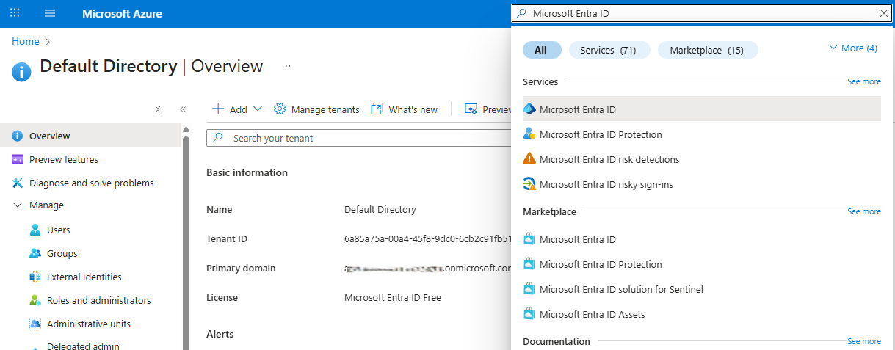
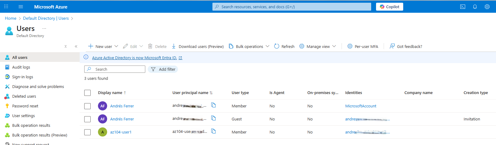
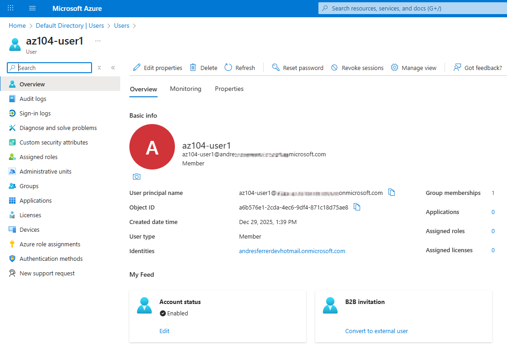
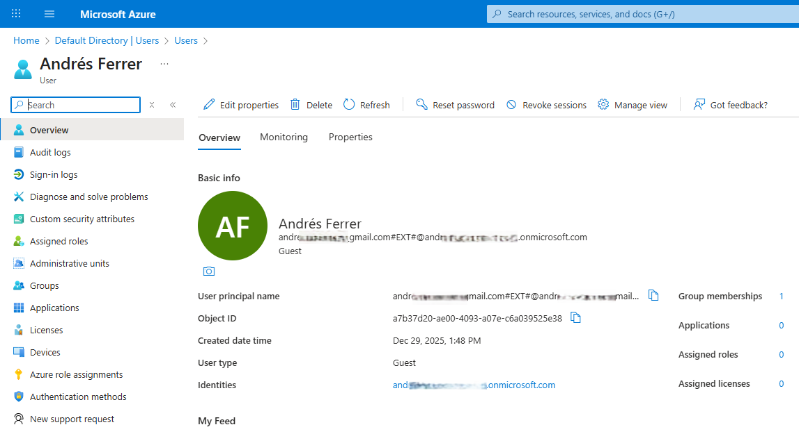
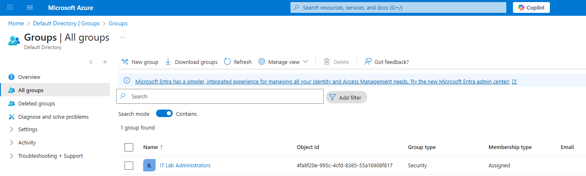
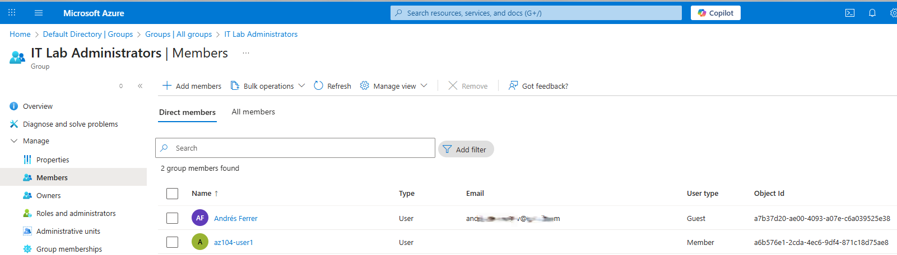
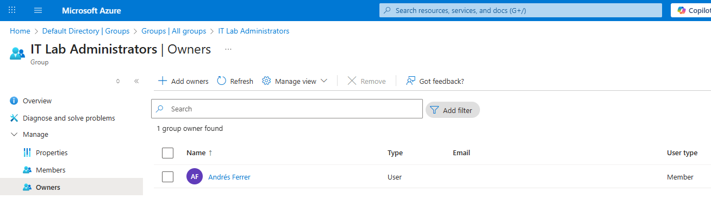

# Lab 01 – Manage Microsoft Entra ID Identities 

🇵🇹 [Versão em Português](README.pt.md)

This lab focuses on managing identities in Microsoft Entra ID, including
the creation of internal users, invitation of external (B2B) guest users,
and the configuration of security groups with proper membership and ownership.

All evidence screenshots are stored in the `./screenshots/` directory.

---

## Microsoft Entra ID – Tenant Overview

This screenshot shows the **Default Directory** in Microsoft Entra ID,
confirming the tenant used to perform this lab.

---

## Users Management

### Users list (Members and Guests)

This screenshot confirms the presence of:

- Internal users (Members)
- External users (Guests – B2B)

---

### Internal user validation – az104-user1

This screenshot confirms the successful creation of the internal user
**az104-user1** with the following characteristics:

- User type: **Member**
- Account status: **Enabled**
- Correct tenant association

---

### Guest user validation (B2B)

This screenshot confirms the successful invitation of an external
**B2B guest user**, validating:

- User type: **Guest**
- External identity (B2B collaboration)
- Account enabled

---

## Group Management

### Security group creation

This screenshot confirms the creation of the security group
**IT Lab Administrators** with:

- Group type: **Security**
- Membership type: **Assigned**
- Group successfully created in Microsoft Entra ID

---

### Group membership validation

This screenshot confirms that the following users were successfully
added as members of the **IT Lab Administrators** group:

- Internal user (**az104-user1**)
- External guest user

---

### Group owners validation

This screenshot confirms that the **IT Lab Administrators** security group
has a valid owner assigned, fulfilling the lab requirement for proper
group governance.

---

## Lab Outcome

By completing this lab, the following objectives were achieved:

- Created and managed internal users in Microsoft Entra ID
- Invited and validated external (B2B) guest users
- Created a security group with assigned membership
- Configured correct group membership and ownership

This lab demonstrates foundational identity and access management
capabilities required for the **AZ-104 – Microsoft Azure Administrator**
certification.
