# Laboratório 02a — Gerir Assinaturas e RBAC 

🇬🇧 [English version](README.md)


> 📘 **Laboratório Prático AZ-104 (Portuguese)**  
> Parte da minha preparação prática para a certificação de Administrador Microsoft Azure.

## Visão Geral

Este laboratório foca-se na **governação e controlo de acessos do Azure**, especificamente:

- Gerir assinaturas utilizando **Grupos de Gestão**
- Compreender a **herança de âmbito RBAC**
- Atribuir **funções internas do Azure** a grupos
- Criar **funções RBAC personalizadas** para refinar as permissões
- Aplicar o **princípio do menor privilégio**

Estas tarefas são objetivos principais do exame **AZ-104: Microsoft Azure Administrator**.

---

## Pré-requisitos

- Uma subscrição ativa do Azure
- Permissões de Administrador Global ou Proprietário
- Acesso ao locatário Microsoft Entra ID

---

## Objectivos do Laboratório

Ao concluir este laboratório, poderá:

- Validar o estado e a propriedade da assinatura
- Ativar a gestão de acesso em nível de locatário
- Criar e gerir **Grupos de Gestão**
- Criar um **Grupo de segurança do Help Desk**
- Atribuir a função de **Colaborador de Máquina Virtual** no âmbito do Grupo de Gestão
- Criar uma **Função RBAC Personalizada** com exclusões de permissões específicas
- Verificar atribuições e herança de RBAC

---

## Evidências (Capturas de Ecrã)

Todas as capturas de ecrã estão armazenadas no diretório `./screenshots/` e validam a execução bem-sucedida de cada tarefa.

---

## 1️⃣ Validação da Assinatura

### Assinatura ativa e propriedade confirmada

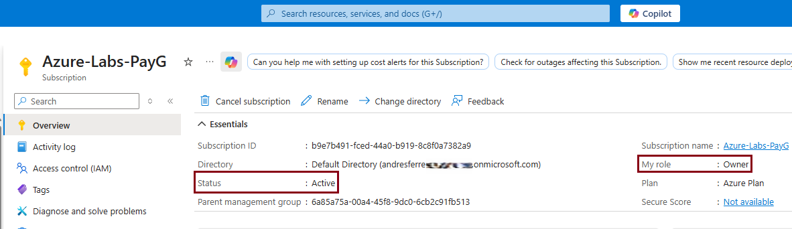

Esta captura de ecrã confirma que:

- A subscrição está **Ativa**
- O utilizador ligado possui a função de **Proprietário**
- A assinatura está associada ao tenant correto

---

## 2️⃣ Gestão de Acesso ao Locatário Ativado

### Microsoft Entra ID — Gestão de acesso para recursos do Azure

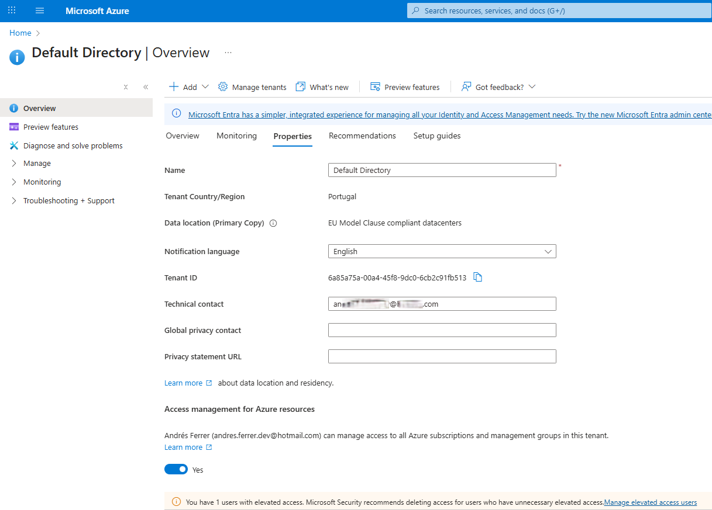

Esta captura de ecrã confirma que:

- A **Gestão de acesso para recursos do Azure** está ativada
- O utilizador pode gerir o acesso entre **assinaturas e grupos de gestão**

- As permissões ao nível do locatário estão configuradas corretamente

---

## 3️⃣ Grupos de Gestão

### Grupos de Gestão Visão geral

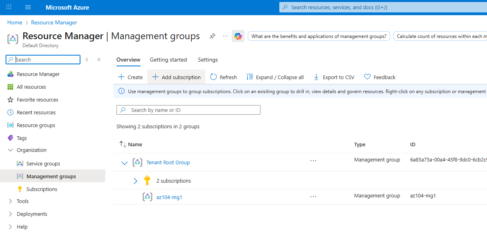

Esta captura de ecrã mostra:

- O **Grupo Raiz do Locatário**
- Assinaturas existentes
- Ponto de entrada de governação centralizada

---

### Criação de Grupo de Gestão

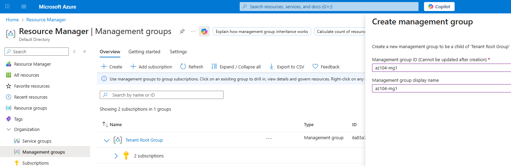

Foi criado um grupo de gestão com a seguinte configuração:

- **ID do Grupo de Gestão:** `az104-mg1`
- **Nome de visualização:** `az104-mg1`
- Grupo pai: **Grupo Raiz do Locatário**

---

### Validação da hierarquia do Grupo de Gestão

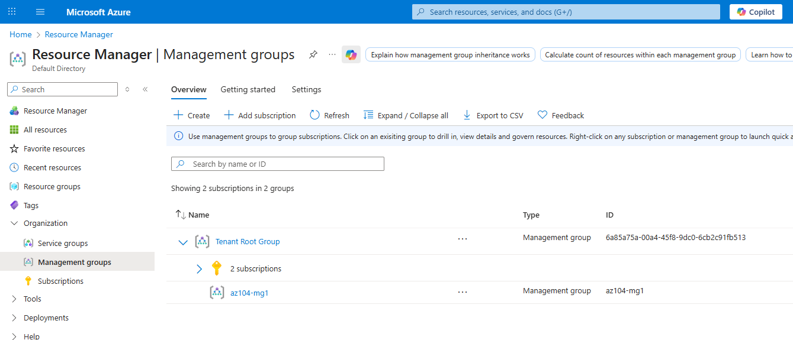

Esta captura de ecrã confirma que:

- `az104-mg1` existe
- Está corretamente posicionado abaixo do **Grupo Raiz do Inquilino**
- As assinaturas podem herdar políticas e RBAC deste âmbito

---

## 4️⃣ Grupo de Segurança do Help Desk

### Grupo Help Desk criado

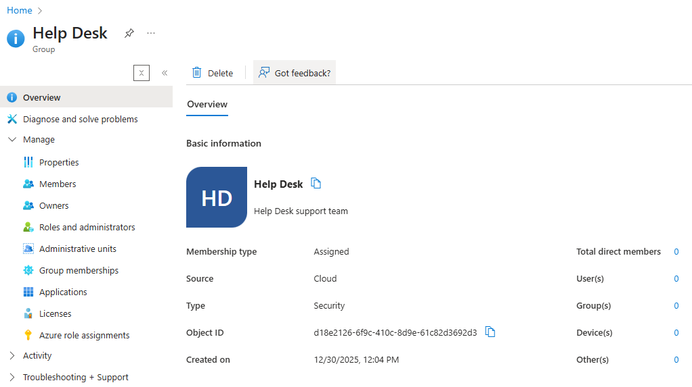

Esta captura de ecrã confirma a criação de um grupo de segurança com:

- **Nome:** Help Desk
- **Tipo de grupo:** Segurança
- **Tipo de associação:** Atribuído
- Utilização prevista: Delegação de acesso da equipa de suporte

---

## 5️⃣ Atribuição de Função RBAC

### Colaborador da Máquina Virtual atribuído no âmbito do Grupo de Gestão

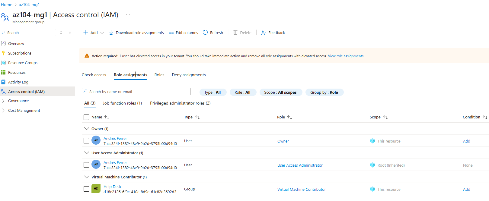

Esta captura de ecrã confirma que:

- O grupo **Help Desk** recebeu a função **Virtual Machine Colaborador**
- Âmbito: **Grupo de Gestão (`az104-mg1`)**
- As permissões são herdadas por todas as assinaturas do grupo.

Esta configuração permite aos utilizadores do Help Desk:

- Criem e gerenciem máquinas virtuais
- Executem operações relacionadas com VMs
- Sem conceder acesso administrativo completo

---

## 6️⃣ Criação de Função RBAC Personalizada

### Criação da Função "Pedido de Suporte Personalizado"

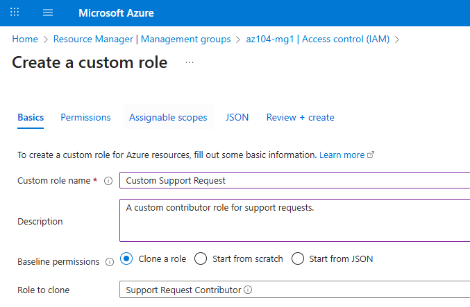

Para aplicar rigorosamente o **princípio do menor privilégio**, foi criada uma função personalizada clonando uma função integrada.

- **Nome da Função:** Pedido de Suporte Personalizado
- **Permissões Básicas:** Clonada de **Colaborador de Pedido de Suporte**
- **Descrição:** Uma função de colaborador personalizada para pedidos de suporte.

---

### Apagar Permissões Confidenciais


A função padrão "Colaborador de Pedidos de Suporte" permite o registo de fornecedores de recursos, um privilégio elevado que não é necessário para as tarefas diárias do Help Desk.

- **Permissão Eliminada:** `Microsoft.Support/register/action`
- **Resultado:** Esta permissão é adicionada a `NotActions`, impedindo explicitamente o Help Desk de registar o Fornecedor de Recursos de Suporte.

---

### Definir Escopos Atribuíveis

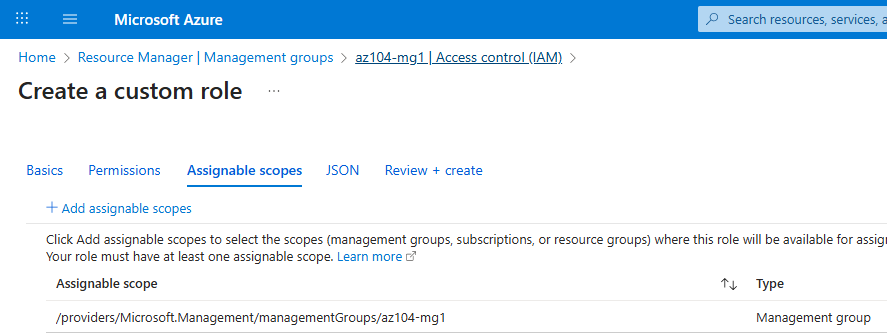

A função personalizada é restrita a um âmbito específico para evitar a utilização noutros locais no tenant.

- **Âmbito:** `az104-mg1` (Grupo de Gestão)
- Isso garante

A função está apenas disponível para atribuição dentro desta hierarquia específica de grupo de gestão.

---

### Revisão e Validação de JSON

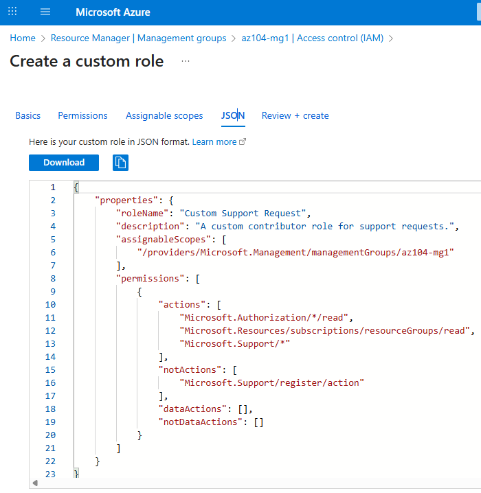

A definição final de JSON valida a personalização:

```json
"permissões": [

{

"actions": [
"Microsoft.Authorization/*/read",

"Microsoft.Resources/subscriptions/resourceGroups/read",

"Microsoft.Support/*"

],

"notActions": [
"Microsoft.Support/register/action"

],

"assignableScopes": [
"/fornecedores/Microsoft.Management/managementGroups/az104-mg1"

]

}
]
```

Esta função personalizada garante que os utilizadores do Help Desk podem gerir pedidos de suporte
sem obter privilégios elevados que possam ter impacto na governação do locatário.

---

## 7️⃣ Monitorizar Atribuições de Funções (Registo de Atividades)

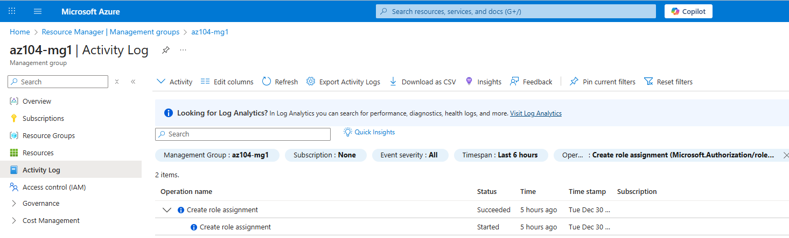

### Criação da Função "Pedido de Suporte Personalizado"

# Rever Eventos de Atribuição de Funções

Para validar e auditar as alterações de RBAC realizadas durante este laboratório, foi utilizado o
**Registo de Atividades do Azure**. O Registo de Atividades regista
operações ao nível da subscrição e ao nível do grupo de gestão, incluindo atribuições de funções e criação de funções personalizadas.

---

## Etapas executadas

1.º Naveguei até **Grupos de Gestão** → `az104-mg1`.

2.º Selecionei **Registo de atividades** no menu do lado esquerdo.

3.º Filtrei o log para isolar os eventos relevantes:

- **Categoria:** `Administrativo`

- **Operação:** `Criar atribuição de função` e

`Criar ou atualizar função personalizada`

---

## Validação

A captura de ecrã confirma que:

- A atribuição da função **Colaborador de Máquina Virtual** ao grupo Help Desk

foi registada.

- A criação da função **Pedido de Suporte Personalizado** foi registada.

- Todas as alterações administrativas são rastreáveis ​​para efeitos de governação e auditoria.

## ✅ Resumo da Validação em Laboratório

Os seguintes requisitos foram cumpridos com sucesso:

- [x] Assinatura validada e ativa
- [x] Gestão de acesso ao nível de locatário habilitado
- [x] Grupo de Gestão criado e verificado
- [x] Grupo de segurança do Help Desk criado
- [x] Função RBAC atribuída com o âmbito correto
- [x] Função RBAC personalizada criada (Clonada e Modificada)
- [x] Atribuições de funções auditadas através do Registo de Atividades

---

## 🔑 Principais Conclusões

- **Grupos de Gestão** permitem uma governação escalável em
  assinaturas.

- **Herança RBAC** simplifica o controlo de acessos.

- **Funções Personalizadas** são essenciais quando as funções incorporadas concedem permissões em excesso
  (privilégios excessivos).

- **Log de Atividades** é uma ferramenta crítica de governação que auxilia
  auditorias de segurança, rastreando _quem alterou o quê e quando_.

- Conceda sempre permissões com o **menor âmbito necessário**.

---

## 📝 Dicas para o Exame (AZ-104)

- Os Grupos de Gestão estão **acima das assinaturas**.

- As atribuições do RBAC são herdadas **para baixo**.

- As funções personalizadas requerem a definição de **Escopos Atribuíveis** (podem ser Grupo de Gestão,
  Assinatura ou Grupo de Recursos).

- As **NotActions** são subtrativas: mesmo que uma Ação conceda `*` (tudo),

uma `NotAction` bloqueará esta operação específica.

- O **Retentor do Registo de Atividades** é de **90 dias** por defeito.

- O Registo de Atividades regista as operações do **plano de controlo** (Administrativo),

não do plano de dados.

---

## 📌 Estado do Laboratório

✅ **Concluído**
