# Laboratório 02b — Gerir a Governação via Azure Policy 

🇬🇧 [English version](README.md)


> 📘 **AZ-104 Hands-on Lab (Poruguese)**  
> Part of my practical preparation for the Microsoft Azure Administrator certification.

## Visão Geral

Neste laboratório, aprenderá a implementar os planos de governação da sua organização. Aprenderá como as políticas do Azure podem garantir que as decisões operacionais são aplicadas em toda a organização. Aprenderá como utilizar a marcação de recursos para melhorar a geração de relatórios.

Este laboratório concentra-se na implementação de **controlos de governação do Azure** utilizando **Azure Policy**, **marcação de recursos** e **bloqueios de recursos**.

Aprenderá como:

- Aplicar **etiquetas de recursos** para **governação** e **gestão de custos**
- Impor **regras de etiquetagem** utilizando a **Política do Azure**
- Corrigir automaticamente **etiquetas em falta**
- Proteger recursos utilizando **bloqueios de recursos do Azure**

Estas tarefas são objetivos principais da certificação **AZ-104: Microsoft Azure Administrator**.

## Tempo estimado

⏱️ 30 minutos

## Pré-requisitos

- Uma subscrição ativa do Azure
- Permissões de Proprietário ou Colaborador na assinatura
- Acesso ao portal Azure
- Subscrição associada a um Grupo de Gestão (recomendado)

> ⚠️ Nota: Os passos do laboratório fazem referência à **Região Leste dos EUA**, mas pode utilizar outra região, se necessário.

## Cenário do Laboratório

A presença da sua organização na cloud cresceu significativamente no último ano.

Uma auditoria recente revelou que muitos recursos do Azure não possuem:

- Proprietário
- Projeto
- Centro de custo definidos

Para melhorar a governação e a gestão de recursos, decide implementar o seguinte:

- Aplicar tags de recursos para anexar metadados aos recursos
- Impor a marcação obrigatória utilizando a Política Azure
- Atualizar automaticamente os recursos existentes com etiquetas em falta
- Proteger recursos críticos utilizando bloqueios de recursos

## Diagrama de Arquitetura

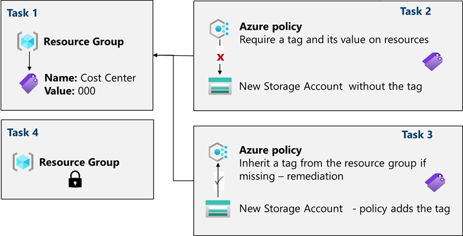

O seguinte diagrama representa o fluxo de governação implementado neste laboratório:

**Explicação:**

- As etiquetas são definidas ao nível do grupo de recursos
- A Política Azure impõe a conformidade com as etiquetas
- Os recursos não conformes são bloqueados ou corrigidos
- Os bloqueios de recursos protegem os recursos configurados

## Evidências (Capturas de ecrã)

Todas as capturas de ecrã estão armazenadas no diretório `./screenshots/` e validam a execução bem-sucedida de cada tarefa.

## Competências Praticadas

- Criar e atribuir tags de recursos
- Aplicar regras de governação utilizando o Azure Policy
- Aplicar a correção automática para recursos não conformes
- Configurar e testar bloqueios de recursos do Azure

## Task 1️⃣ — Assign Tags via the Azure Portal

### Objetivo

Nesta task, é criada e atribuída uma tag a um **Azure resource group** através do **Azure portal**.
As tags são um componente crítico de uma estratégia de governance, conforme definido pelo
**Microsoft Well-Architected Framework** e pelo **Cloud Adoption Framework**.

As tags permitem identificar rapidamente proprietários de recursos, centros de custo,
datas de desativação, contactos de grupo e outros pares nome/valor considerados relevantes
pela organização.

Para esta task, é atribuída uma tag que identifica o **Cost Center** do recurso.

Criar um resource group e atribuir uma tag **Cost Center** utilizando o Azure portal.

As tags são um mecanismo essencial de governance, alinhado com:

- Microsoft Well-Architected Framework
- Cloud Adoption Framework

Permitem às organizações controlar **custos, responsabilidade e ownership**.

---

### Passos

1. Iniciar sessão no **Azure portal**  
   [https://portal.azure.com](https://portal.azure.com)

2. Pesquisar e selecionar **Resource groups**

3. Selecionar **+ Create**

4. Configurar o resource group:

| Setting             | Value             |
| :------------------ | :---------------- |
| Subscription        | Your subscription |
| Resource group name | `az104-rg2`       |
| Location            | East US           |

> ℹ️ **Nota**  
> Cada lab utiliza um resource group dedicado para simplificar a gestão e a limpeza dos recursos.

5. Selecionar **Next: Tags**

6. Adicionar a seguinte tag:

| Name        | Value |
| :---------- | :---- |
| Cost Center | 000   |

7. Selecionar **Review + Create** e depois **Create**

---

### Evidência — Resource Group com Tag

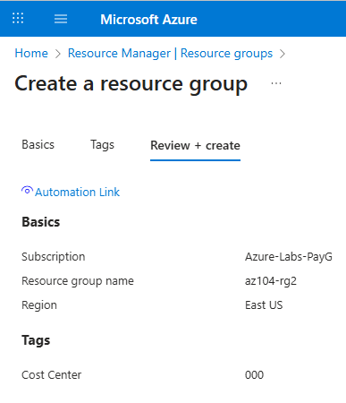

Este screenshot confirma que:

🔹 **Resource Group**

- **Name:** `az104-rg2` ✅
- **Subscription:** `Azure-Labs-PayG` ✅
- **Region:** `East US` ✅

---

### Validação

- O resource group `az104-rg2` foi criado com sucesso
- A tag **Cost Center: 000** está visível ao nível do resource group

Esta tag será utilizada posteriormente pela **Azure Policy** para efeitos de
enforcement e remediation.

---

### 🧠 Como isto se liga à Task 2 (importante)

Este passo está **corretamente executado** porque:

- A **Task 2** depende da existência da tag **Cost Center**
- A **Azure Policy** irá:
  - Bloquear a criação de recursos **sem tag**
  - Ou herdar a tag a partir do resource group (na **Task 3**)

Se a Task 1 não estivesse corretamente configurada, **todo o restante laboratório falharia**.

## Task 2️⃣ — Enforce Tagging via Azure Policy

### Objetivo

Atribuir uma **Azure Policy** integrada (built-in) para impor a presença obrigatória
da tag **Cost Center** em todos os recursos dentro do resource group.

Isto garante que as regras de governance são **aplicadas automaticamente**,
impedindo a criação de recursos que não estejam em conformidade.

---

### Visão Geral da Policy

A Azure Policy integrada **Require a tag and its value on resources** é utilizada para:

- Validar a existência de uma tag específica
- Validar o valor da tag
- **Negar a criação de recursos** caso o requisito não seja cumprido

Esta policy aplica governance **no momento do deployment**, prevenindo configuration drift.

---

### Comportamento da Policy

- A Azure Policy avalia os recursos **antes do deployment**
- Se um recurso for criado **sem a tag obrigatória**, o deployment é bloqueado
- A aplicação é automática e consistente

---

### Atribuição da Policy

A policy foi atribuída com a seguinte configuração:

| Setting            | Value                                              |
| ------------------ | -------------------------------------------------- |
| Policy definition  | Require a tag and its value on resources           |
| Scope              | Resource Group `az104-rg2`                         |
| Assignment name    | Require Cost Center tag and its value on resources |
| Policy enforcement | Enabled                                            |
| Tag name           | Cost Center                                        |
| Tag value          | 000                                                |

> ℹ️ A policy está aplicada ao nível do **resource group**, garantindo que todos os recursos criados dentro deste âmbito cumprem os requisitos de tagging.

---

### Passos de Implementação

1. No **Azure portal**, pesquisar e selecionar **Policy**.

2. Na secção **Authoring**, selecionar **Definitions** e procurar a policy integrada:

   - **Require a tag and its value on resources**

3. Selecionar a definição da policy e escolher **Assign**.

4. Definir o **Scope** para o resource group:

   - Resource group: `az104-rg2`

5. No separador **Basics**, configurar:

   - Assignment name: `Require Cost Center tag and its value on resources`
   - Description: `Require Cost Center tag and its value on all resources in the resource group`
   - Policy enforcement: **Enabled**

6. No separador **Parameters**, definir:

   - Tag name: `Cost Center`
   - Tag value: `000`

7. Em **Remediation**, manter os valores por defeito e **não** selecionar
   **Create a Managed Identity** para esta task.

8. Selecionar **Review + create** e depois **Create** para atribuir a policy.

9. Aguardar alguns minutos para que a policy entre em vigor
   (pode demorar **5–10 minutos**).

10. Para testar a aplicação da policy, tentar criar uma **Storage Account**
    no resource group `az104-rg2` **sem adicionar a tag obrigatória**.

11. Confirmar que o deployment falha com **RequestDisallowedByPolicy**.

---

### Teste da Aplicação da Policy

Para validar a policy, foi tentado o deployment de uma **Storage Account**
**sem especificar a tag obrigatória**.

- Resource type: Storage Account
- Resource group: `az104-rg2`
- Tag provided: **None**

---

### Evidência — Atribuição da Policy

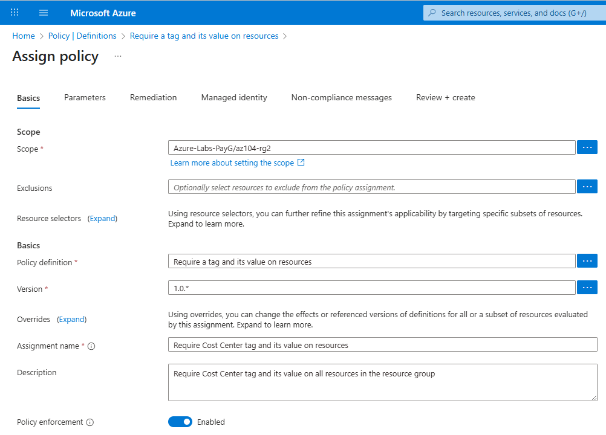

### Evidência — Parâmetros da Policy

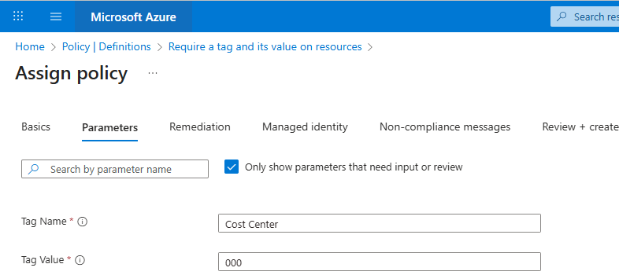

### Definição da Policy (Built-in)

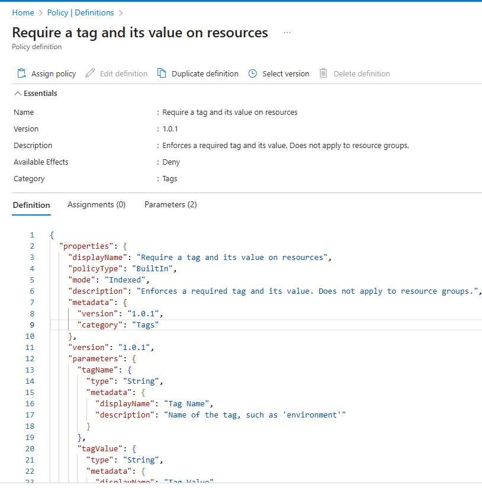

A Azure Policy integrada **Require a tag and its value on resources** está implementada
como uma policy **Deny** parametrizada.

Principais características desta policy:

- **Policy type:** Built-in
- **Mode:** Indexed
- **Effect:** Deny
- **Category:** Tags
- **Applies to:** Resources (não se aplica a resource groups)

A policy utiliza parâmetros para validar dinamicamente as tags dos recursos:

- **tagName** — nome da tag obrigatória (ex.: `Cost Center`)
- **tagValue** — valor obrigatório da tag (ex.: `000`)

No momento do deployment, a Azure Policy avalia o pedido segundo a seguinte lógica:

- Se o recurso **não contiver a tag especificada**
- Ou se o valor da tag **não corresponder ao valor exigido**
- O deployment é **negado**

Este comportamento garante que as regras de governance são aplicadas de forma consistente
e impede a criação de recursos fora de conformidade.

### Evidência — Deployment Bloqueado pela Policy

O deployment falhou com o seguinte erro:

```text
Validation failed.
Resource was disallowed by policy.
(Code: RequestDisallowedByPolicy)
```

## Task 3️⃣ — Aplicar Tagging via uma Azure Policy (Remediation)

### Objective

Aplicar tagging de forma automática utilizando uma Azure Policy com efeito **Modify**.
Os recursos que não tenham a tag obrigatória irão **herdar a tag a partir do resource group**.

Esta abordagem garante conformidade **sem bloquear deployments** e permite
a remediação automática de recursos não conformes.

---

### Policy Overview

A Azure Policy built-in **Inherit a tag from the resource group if missing** é utilizada para:

- Detetar recursos que não possuem uma determinada tag
- Aplicar automaticamente a tag com base no valor definido no resource group
- Remediar recursos existentes e recém-criados

Esta policy utiliza o efeito **Modify** e suporta remediação.

---

### Policy Behavior

- Recursos criados **sem a tag obrigatória** são permitidos
- A Azure Policy **adiciona automaticamente a tag em falta**
- O valor da tag é herdado do resource group
- Os deployments **não são bloqueados**

---

### Pre-requisite — Remover a Policy Deny anterior (Task 2)

Antes de aplicar a policy de remediação, a policy com efeito **Deny** atribuída na Task 2
tem de ser removida.

Assignment a eliminar:

- **Name:** `Require Cost Center tag and its value on resources`
- **Type:** Policy
- **Scope:** `Azure-Labs-PayG/az104-rg2`
- **Effect:** Deny

> ℹ️ **Porque isto é obrigatório**  
> Policies com efeito **Deny** têm prioridade sobre policies **Modify**.  
> Se a policy Deny não for removida, a remediação **nunca será executada**
> e os deployments continuarão a falhar.

#### Evidence — Remoção da Policy Deny


---

### Implementation Steps

1. No **Azure portal**, navegar até **Policy**.

2. Em **Authoring**, selecionar **Assignments** e eliminar a assignment anterior:

   - **Require a tag and its value on resources**

3. Selecionar **Assign policy** e definir o **Scope** para:

   - Resource group: `az104-rg2`

4. Selecionar a policy built-in:

   - **Inherit a tag from the resource group if missing**

5. Em **Basics**, configurar:
   - Assignment name: `Inherit Cost Center tag from resource group if missing`
   - Description: `Automatically inherit the Cost Center tag from the resource group`
   - Policy enforcement: **Enabled**

#### Evidence — Policy Assignment (Modify)

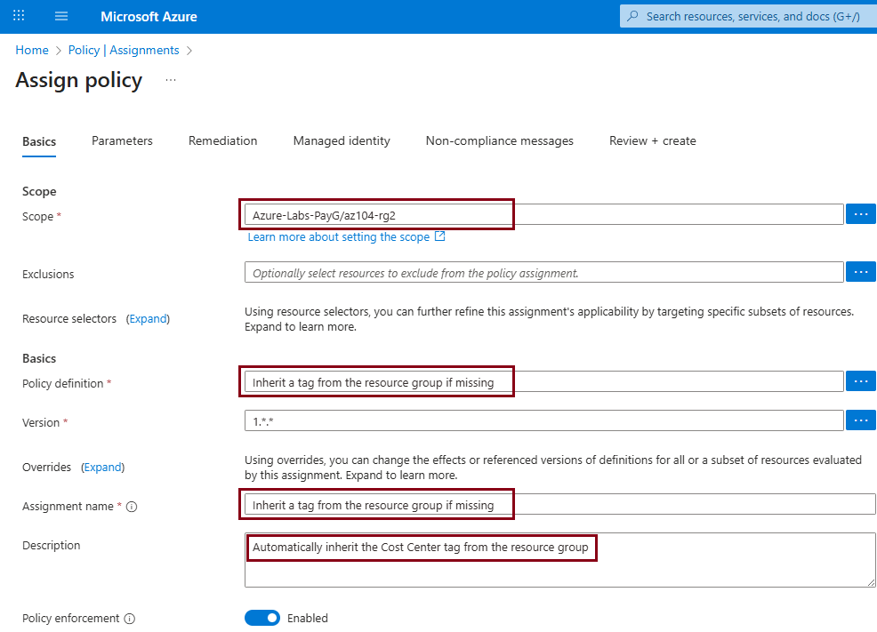

6. Em **Parameters**, definir:
   - Tag name: `Cost Center`

#### Evidence — Policy Parameters

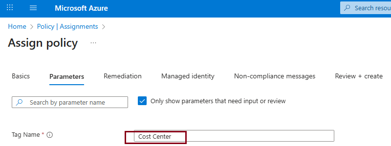

7. Em **Remediation**, ativar:

   - **Create a remediation task**

   > ℹ️ Esta policy utiliza o efeito **Modify**, pelo que é necessária
   > a criação de uma **managed identity**.

#### Evidence — Policy Remediation Ativada

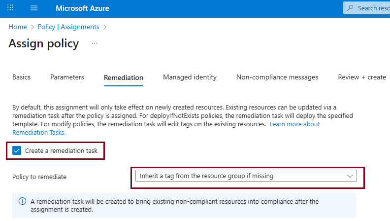

8. Selecionar **Review + create** e depois **Create**.

---

### Evidence — Estado Final das Policy Assignments

Este ecrã confirma que apenas a policy com efeito **Modify**
está ativa no scope do resource group.

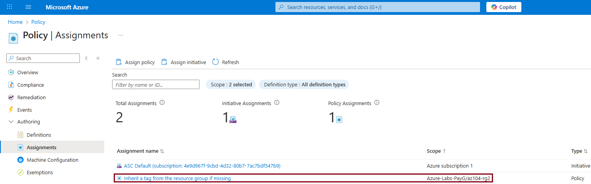

---

### Testing Policy Remediation

1. Criar uma nova **Storage Account** no resource group `az104-rg2`
   **sem especificar a tag Cost Center**.

2. Confirmar que o deployment **é bem-sucedido**.

3. Abrir o recurso criado e aceder à secção **Tags**.

---

### Validation

- O recurso foi criado com sucesso **sem tagging manual**
- A tag **Cost Center: 000** foi adicionada automaticamente
- O valor da tag foi herdado do resource group

Isto confirma que a remediação através de Azure Policy
está a funcionar corretamente.

---

### AZ-104 Relevance

- Policies com efeito **Modify** podem alterar a configuração de recursos
- A remediação requer uma **managed identity**
- A Azure Policy pode garantir conformidade **sem bloquear deployments**
- A herança de tags é um padrão de **governance** frequentemente avaliado no AZ-104

## Task 4️⃣ — Configurar e Testar Resource Locks

### Objective

Proteger os recursos do laboratório contra eliminações acidentais através da
configuração de **Azure Resource Locks** ao nível do **resource group**.

Os Resource Locks são um mecanismo de **governança pós-deployment** que impede
operações destrutivas, mesmo quando executadas por utilizadores com permissões
elevadas.

Nesta task, é aplicado um **Delete lock** a um resource group e o seu
funcionamento é validado através da tentativa de uma operação destrutiva.

---

### Resource Lock Overview

Os **Azure Resource Locks** permitem proteger recursos críticos contra:

- Eliminações acidentais
- Alterações não intencionais

Existem dois tipos de locks:

| Lock type    | Description                    |
| ------------ | ------------------------------ |
| **Delete**   | Impede a eliminação do recurso |
| **ReadOnly** | Impede alterações e eliminação |

Nesta task é utilizado um **Delete lock**.

Os locks podem ser aplicados nos seguintes níveis (scopes):

- Subscription
- Resource Group
- Recurso individual

> ℹ️ Os Resource Locks **não substituem o RBAC** — eles **sobrepõem-se às permissões dos utilizadores**.

---

### Governance Context

Os controlos de governança no Azure atuam em diferentes fases:

- **Azure Policy** → governa configuração e compliance (pré-deployment)
- **RBAC** → controla quem pode executar ações
- **Resource Locks** → protegem operações críticas (pós-deployment)

👉 Os Resource Locks são avaliados **após o RBAC**, funcionando como uma
**última barreira de segurança**.

---

### Implementation Steps — Criar um Delete Lock

1. No **Azure portal**, navegar até **Resource groups**.
2. Selecionar o resource group:
   - `az104-rg2`
3. No menu lateral esquerdo, selecionar **Locks**.
4. Selecionar **+ Add** para criar um novo lock.
5. Configurar o lock com os seguintes valores:

| Setting   | Value                                        |
| --------- | -------------------------------------------- |
| Lock name | `rg-delete-lock`                             |
| Lock type | **Delete**                                   |
| Notes     | Prevent accidental deletion of lab resources |

6. Selecionar **OK** para aplicar o lock.

---

### Evidence — Criação do Resource Lock

O screenshot seguinte mostra a **criação de um Delete lock** ao nível do
resource group, incluindo o nome do lock, tipo e descrição.

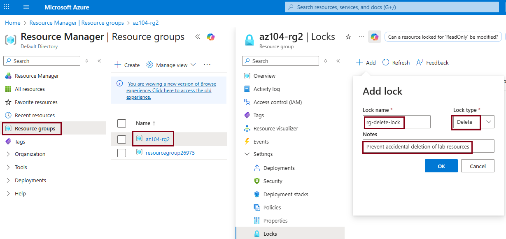

---

### Evidence — Resource Lock Ativo (Após Criação)

O screenshot seguinte confirma que o **Delete lock está ativo e aplicado**
ao resource group.

- **Lock name:** `rg-delete-lock`
- **Lock type:** Delete
- **Scope:** `az104-rg2`

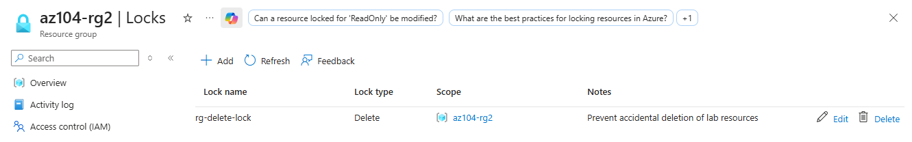

---

### Testing the Delete Lock — Tentativa de Eliminação do Resource Group

Para validar o comportamento do lock, foi intencionalmente executada uma
operação destrutiva.

Passos realizados:

1. Navegar até ao resource group `az104-rg2`.
2. Selecionar **Delete resource group**.
3. Introduzir o nome do resource group para confirmar a eliminação.
4. Selecionar **Delete**.

---

### Evidence — Tentativa de Eliminação (Ecrã de Confirmação)

Este screenshot mostra o ecrã de confirmação da eliminação do resource group.


---

### Evidence — Eliminação Bloqueada pelo Resource Lock

A tentativa de eliminação falhou conforme esperado.

O Azure devolveu um erro indicando que o resource group está **locked**
e não pode ser eliminado.


---

### Expected Result

- ❌ O resource group **não pode ser eliminado**
- ❌ A operação é bloqueada mesmo com permissões elevadas
- ✅ O **Delete lock** está ativo e aplicado

---

### Validation

- O resource group `az104-rg2` está protegido por um **Delete lock**
- Operações destrutivas são bloqueadas
- A proteção de governança está corretamente aplicada

Isto confirma que o **Azure Resource Lock** está a funcionar conforme esperado.

---

### AZ-104 Relevance

- Os Resource Locks protegem recursos críticos contra eliminações acidentais
- Os locks sobrepõem-se às permissões RBAC
- Podem ser aplicados a **subscription**, **resource group** ou **recurso**
- São avaliados **após o RBAC**
- São um controlo de governança **pós-deployment**

---

### 🧠 Key Exam Insight

> **Azure Policy** define _o que pode ser implementado_  
> **RBAC** define _quem pode executar ações_  
> **Resource Locks** definem _o que não pode ser alterado ou eliminado_

> **Importante:**  
> Mesmo utilizadores com permissões **Owner** **não conseguem eliminar**
> um recurso protegido por um Resource Lock.

Este modelo de governança é **frequentemente testado no exame AZ-104**.
