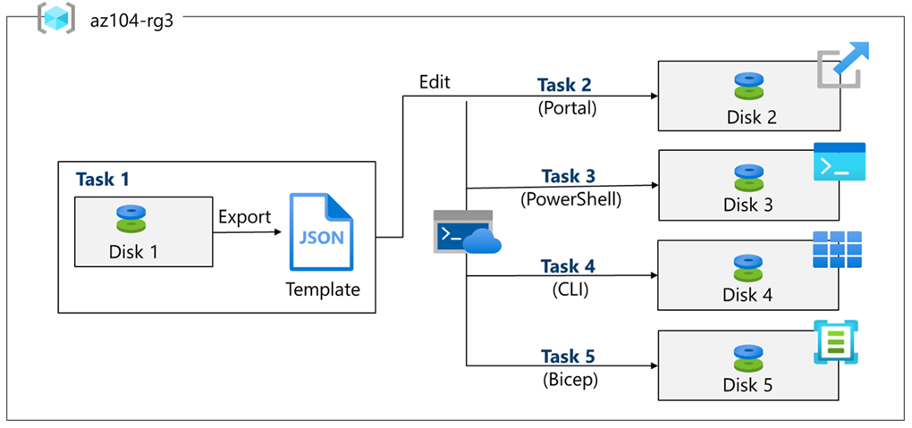
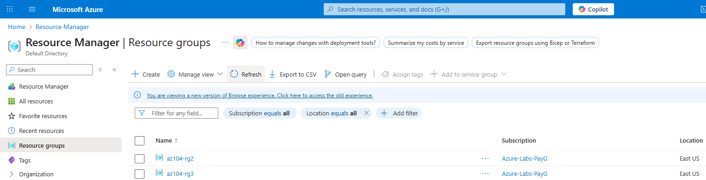

# Lab 03 — Manage Azure resources by using Azure Resource Manager (ARM) Templates (Field Notes)

## Context & Goal

This lab is part of my **AZ-104 field notes**.  
The objective is not only to execute the lab steps, but to document them as a **technical notebook**, capturing:

- **Architectures** and deployment flows
- **Technical decisions** (why a specific method or tool was chosen)
- **Troubleshooting** (errors encountered and how they were resolved)
- **Governance and cost awareness** (scope, tagging, cleanup strategy)

### Why this lab matters (AZ-104)

Resource deployments belong to the **Azure control plane** and are a core responsibility of an Azure Administrator.

This lab demonstrates how the **same Azure resource** can be deployed using multiple Infrastructure-as-Code approaches:

- Portal export (ARM JSON template generation)
- Custom template deployment (Portal)
- Azure PowerShell deployment
- Azure CLI deployment
- Bicep deployment

### What “ARM” means (in plain terms)

**Azure Resource Manager (ARM)** is the deployment and management layer of Azure.  
All deployments—whether from the Portal, PowerShell, CLI, ARM templates, or Bicep—are processed through ARM, ensuring consistency, validation, and auditability.

### Starting point

- **Subscription:** `Azure-Labs-PayG`
- **Resource Group:** `az104-rg3` (created during this lab)
- **Region:** East US (default lab region)

> The official lab instructions use **East US**, but the region can be adjusted if required.

---

## Lab Scenario

The scenario explores ways to **automate and standardize resource deployments**, aiming to:

- reduce administrative overhead
- minimize human error
- increase consistency across environments

---

## Architecture (high-level)

This lab deploys multiple **Azure Managed Disks** inside a single Resource Group (`az104-rg3`) using different deployment methods:

- **Task 1:** Create Disk 1 in the Portal and export an ARM template
- **Task 2–4:** Reuse the template to deploy Disk 2–4 (Portal / PowerShell / CLI)
- **Task 5:** Deploy Disk 5 using Bicep

### Architecture notes

Detailed architecture and deployment flow:
➡️ [notes/architecture.md](notes/architecture.md)

---

## Resource Group strategy (governance & cleanup)

A dedicated Resource Group (`az104-rg3`) is used to:

- isolate resources and costs
- simplify cleanup at the end of the lab
- centralize deployments and activity logs

---

## Lab Tasks Overview

| Task   | Deployment method        | Result                 |
| ------ | ------------------------ | ---------------------- |
| Task 1 | Portal + Export          | ARM template generated |
| Task 2 | Portal (Custom template) | Disk 2 deployed        |
| Task 3 | Azure PowerShell         | Disk 3 deployed        |
| Task 4 | Azure CLI                | Disk 4 deployed        |
| Task 5 | Bicep                    | Disk 5 deployed        |

---

## Resource Group Creation — az104-rg3

Before starting the lab tasks, a dedicated Resource Group was created to host all resources.

### What was done

- Resource Group name: **az104-rg3**
- Subscription: `Azure-Labs-PayG`
- Region: **East US**
- Creation method: **Azure Portal**

### Technical decision

Using a dedicated Resource Group allows:

- isolation of lab resources
- simplified cost tracking
- centralized visibility of deployments and activity logs
- full cleanup at the end of the lab

### Evidence

- Resource Group creation form  
  

- Resource Group listed in Resource Manager  
  

- Resource Group overview (initial state, no deployments)  
  

## Task 1 — Portal Deployment & Export Template

- What was done
- Technical decision
- Evidence (screenshots)
- AZ-104 learning points

---

## Task 2 — Custom Template Deployment (Portal)

_To be completed_

---

## Task 3 — PowerShell Deployment

_To be completed_

---

## Task 4 — Azure CLI Deployment

_To be completed_

---

## Task 5 — Bicep Deployment

_To be completed_

---

## Governance & Cost Considerations

➡️ Detailed notes: [notes/governance-costs.md](notes/governance-costs.md)

---

## Technical Decisions

➡️ Detailed notes: [notes/technical-decisions.md](notes/technical-decisions.md)

---

## Common Issues & Fixes

➡️ Troubleshooting log: [notes/troubleshooting.md](notes/troubleshooting.md)

---

## AZ-104 Exam Mapping

- ARM is the control-plane deployment engine
- Templates are idempotent
- Deployments are scoped (RG / Subscription / MG)
- Bicep is a recommended abstraction over ARM JSON

---

## Lab Status

🟡 In progress — Resource Group created
