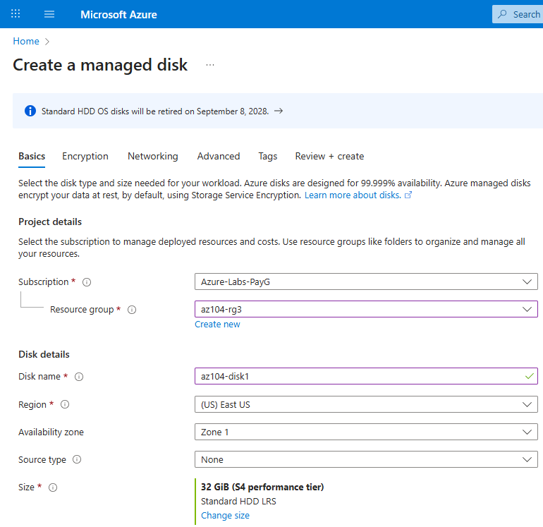
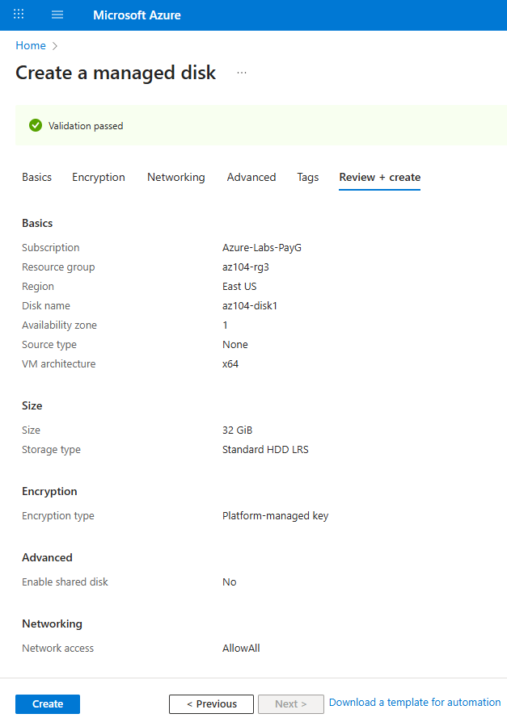
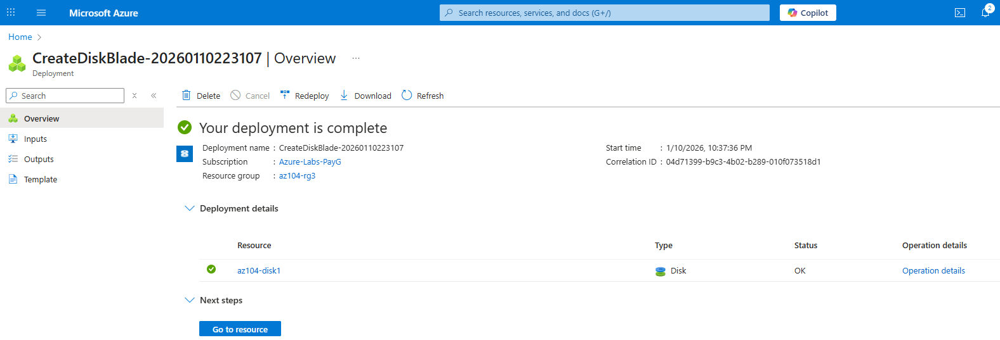
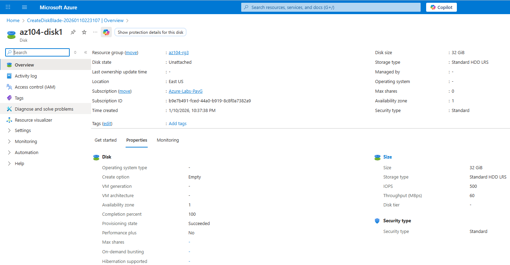
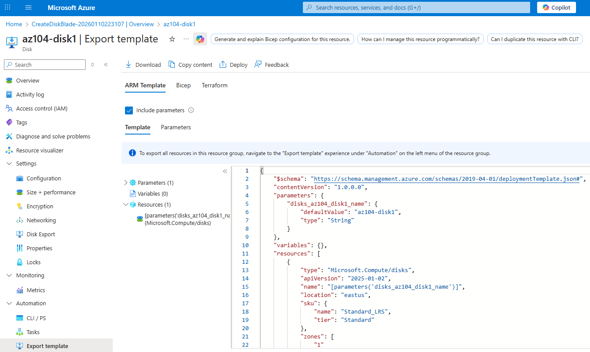
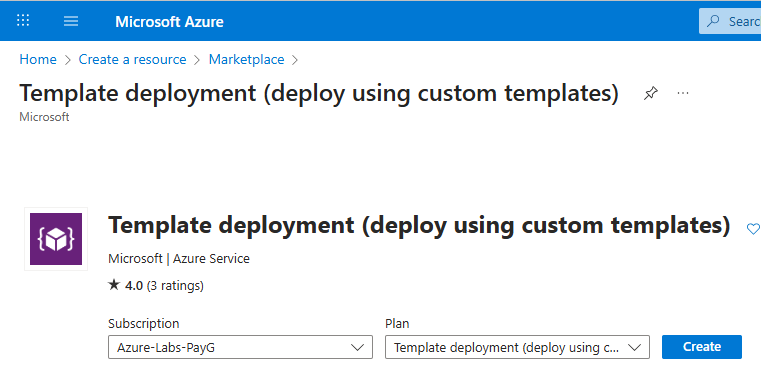
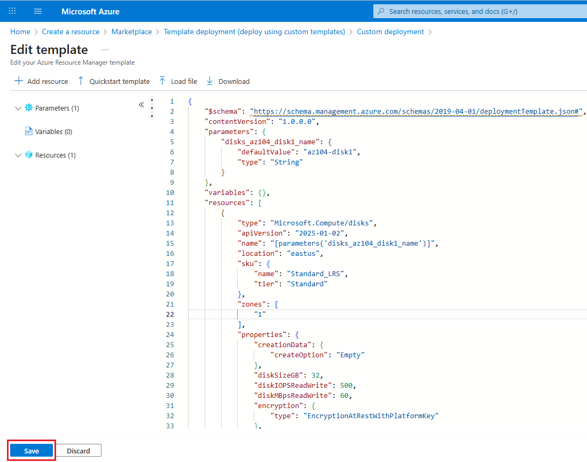
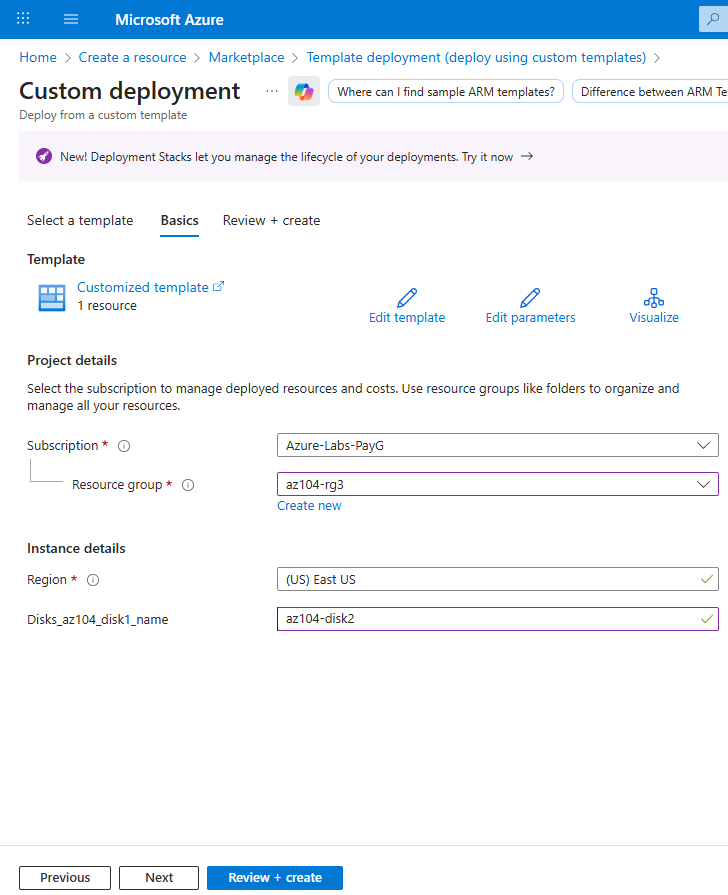
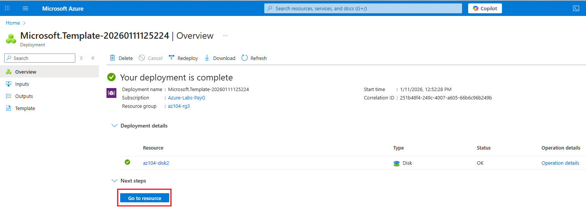

# Lab 03 — Manage Azure resources by using Azure Resource Manager (ARM) Templates (Field Notes)

## Context & Goal

This lab is part of my **AZ-104 field notes**.  
The objective is not only to execute the lab steps, but to document them as a **technical notebook**, capturing:

- **Architectures** and deployment flows
- **Technical decisions** (why a specific method or tool was chosen)
- **Troubleshooting** (errors encountered and how they were resolved)
- **Governance and cost awareness** (scope, tagging, cleanup strategy)

### Why this lab matters (AZ-104)

Resource deployments belong to the **Azure control plane** and are a core responsibility of an Azure Administrator.

This lab demonstrates how the **same Azure resource** can be deployed using multiple Infrastructure-as-Code approaches:

- Portal export (ARM JSON template generation)
- Custom template deployment (Portal)
- Azure PowerShell deployment
- Azure CLI deployment
- Bicep deployment

### What “ARM” means (in plain terms)

**Azure Resource Manager (ARM)** is the deployment and management layer of Azure.  
All deployments—whether from the Portal, PowerShell, CLI, ARM templates, or Bicep—are processed through ARM, ensuring consistency, validation, and auditability.

### Starting point

- **Subscription:** `Azure-Labs-PayG`
- **Resource Group:** `az104-rg3` (created during this lab)
- **Region:** East US (default lab region)

> The official lab instructions use **East US**, but the region can be adjusted if required.

---

## Lab Scenario

The scenario explores ways to **automate and standardize resource deployments**, aiming to:

- reduce administrative overhead
- minimize human error
- increase consistency across environments

---

## Architecture (high-level)

This lab deploys multiple **Azure Managed Disks** inside a single Resource Group (`az104-rg3`) using different deployment methods:

- **Task 1:** Create Disk 1 in the Portal and export an ARM template
- **Task 2–4:** Reuse the template to deploy Disk 2–4 (Portal / PowerShell / CLI)
- **Task 5:** Deploy Disk 5 using Bicep

### Architecture notes

Detailed architecture and deployment flow:  
➡️ [notes/architecture.md](notes/architecture.md)

---

## Resource Group strategy (governance & cleanup)

A dedicated Resource Group (`az104-rg3`) is used to:

- isolate resources and costs
- simplify cleanup at the end of the lab
- centralize deployments and activity logs

---

## Lab Tasks Overview

| Task   | Deployment method        | Result                 |
| ------ | ------------------------ | ---------------------- |
| Task 1 | Portal + Export          | ARM template generated |
| Task 2 | Portal (Custom template) | Disk 2 deployed        |
| Task 3 | Azure PowerShell         | Disk 3 deployed        |
| Task 4 | Azure CLI                | Disk 4 deployed        |
| Task 5 | Bicep                    | Disk 5 deployed        |

---

## Resource Group Creation — az104-rg3

Before starting the lab tasks, a dedicated Resource Group was created to host all resources.

### What was done

- Resource Group name: **az104-rg3**
- Subscription: `Azure-Labs-PayG`
- Region: **East US**
- Creation method: **Azure Portal**

### Technical decision

Using a dedicated Resource Group allows:

- isolation of lab resources
- simplified cost tracking
- centralized visibility of deployments and activity logs
- full cleanup at the end of the lab

### Evidence

- Resource Group creation form  
  

- Resource Group listed in Resource Manager  
  

- Resource Group overview (initial state, no deployments)  
  

---

## Task 1 — Create Managed Disk and Export ARM Template

In this task, an Azure Managed Disk was created using the Azure Portal and the corresponding ARM template was exported for reuse in subsequent tasks.

### Objective

- Create a baseline Azure resource using the Portal
- Understand how Azure Resource Manager (ARM) handles deployments
- Export an ARM template for Infrastructure-as-Code reuse

### Step-by-step guide

Detailed tutorial available here:  
➡️ [notes/task1-portal-disk.md](notes/task1-portal-disk.md)

### Evidence

- Disk creation (Basics)  
  

- Review and validation  
  

- ARM deployment overview  
  

- Disk resource overview  
  

- ARM template export  
  

### Output

- `templates/task1-exported/template.json`
- `templates/task1-exported/parameters.json`

### AZ-104 learning points

- Azure Portal deployments are executed through ARM
- Deployments and resources are distinct control-plane objects
- Exported templates are a starting point, not production-ready artifacts

---

## Task 2 — Custom Template Deployment (Portal)

In this task, the ARM template exported in Task 1 was reused to deploy a second managed disk (`az104-disk2`) using **Custom template deployment** in the Azure Portal.

### Objective

- Reuse an existing ARM template
- Deploy a new resource by changing only parameter values
- Demonstrate template reusability and idempotency

### Step-by-step guide

Detailed tutorial available here:  
➡️ [notes/task2-custom-template.md](notes/task2-custom-template.md)

### Evidence

- Custom template entry  
  

- ARM template loaded in editor  
  

- Parameter update (Disk 2)  
  

- Deployment overview  
  

### AZ-104 learning points

- ARM templates can be safely reused across deployments
- Changing parameters allows controlled creation of similar resources
- ARM deployments are declarative and idempotent
- Deployment operations are recorded at the control-plane level

---

## Task 3 — PowerShell Deployment

In this task, the ARM template exported in Task 1 was reused to deploy a third managed disk (`az104-disk3`) using **Azure PowerShell** in **Azure Cloud Shell**.

### Objective

- Reuse an existing ARM template
- Deploy a new resource using Azure PowerShell
- Modify deployment behavior by changing parameter values only
- Demonstrate template reusability and declarative deployments

### Step-by-step guide

Detailed instructions are available here:

📄 [`notes/task3-powershell-deploy.md`](notes/task3-powershell-deploy.md)

### Evidence

Deployment results and verification screenshots are included in the step-by-step guide.

---

## Task 4 — Azure CLI Deployment

In this task, the ARM template exported in Task 1 was reused to deploy an additional managed disk (`az104-disk4`) using **Azure CLI** in **Azure Cloud Shell**.

### Objective

- Reuse an existing ARM template
- Deploy a new resource using Azure CLI
- Modify deployment behavior by changing parameter values only
- Demonstrate template reusability and declarative deployments

### Step-by-step guide

Detailed instructions are available here:

📄 [notes/task4-azure-cli-deploy.md](notes/task4-azure-cli-deploy.md)

### Evidence

Deployment results and verification screenshots are included in the step-by-step guide.

---

## Task 5 — Bicep Deployment

In this task, a new Azure Managed Disk (`az104-disk5`) was deployed using **Azure Bicep**, fulfilling the official Microsoft lab objective
**“Deploy a resource by using Azure Bicep”**.

Bicep is a domain-specific language (DSL) that provides a cleaner, more readable abstraction over ARM JSON templates, while still relying on
**Azure Resource Manager** as the underlying deployment engine.

### Objective

- Deploy a resource using **Azure Bicep**
- Understand the relationship between **Bicep and ARM**
- Reuse the same deployment scope and resource group
- Demonstrate parameterized, declarative deployments
- Validate consistency with previous ARM-based deployments

### Step-by-step guide

Detailed instructions are available here:

📄 [notes/task5-bicep-deploy.md](notes/task5-bicep-deploy.md)

### Evidence

Deployment results and verification screenshots are included in the step-by-step guide, including:

- Bicep CLI installation and validation
- Bicep template compilation (`az bicep build`)
- Successful deployment using Azure CLI
- Resource verification via Azure CLI and Azure Portal

### AZ-104 learning points

- Bicep templates are **transpiled to ARM JSON**
- All Bicep deployments are executed through **Azure Resource Manager**
- Parameterization controls resource creation without modifying templates
- Deployments remain **incremental and idempotent**
- Deployment history is preserved regardless of the IaC abstraction used

---

## Task 6 — Idempotency and Deployment History Validation (Advanced)

This task goes beyond the official Microsoft lab objectives and validates
idempotent behavior and deployment tracking in Azure Resource Manager.

This validation applies to all deployment methods used in this lab
(Portal, PowerShell, Azure CLI), and will also apply to the Bicep-based
deployment in Task 5 once it is completed.

📄 [notes/task6-idempotency-validation.md](notes/task6-idempotency-validation.md)

---

## Governance & Cost Considerations

➡️ Detailed notes: [notes/governance-costs.md](notes/governance-costs.md)

---

### Technical decision

Using a dedicated Resource Group allows:

- isolation of lab resources
- simplified cost tracking
- centralized visibility of deployments and activity logs
- full cleanup at the end of the lab

The Resource Group was intentionally not documented as a full step-by-step tutorial.  
The rationale behind this decision is explained here:  
➡️ [notes/technical-decisions.md](notes/technical-decisions.md)

---

## Common Issues & Fixes

➡️ Troubleshooting log: [notes/troubleshooting.md](notes/troubleshooting.md)

---

## AZ-104 Exam Mapping

- ARM is the Azure control-plane deployment engine
- ARM templates are idempotent
- Deployments are scoped (Resource Group / Subscription / Management Group)
- Bicep is the recommended abstraction over ARM JSON

---

## Lab Status

🟡 In progress — **Lab 03**
