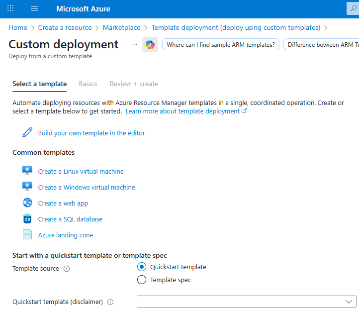
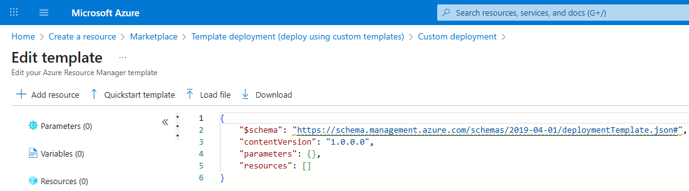

# Task 2 — Deploy a Custom Template (Azure Portal)

This task documents how to deploy an ARM template using **Custom template deployment** in the Azure Portal.  
The goal is to reuse the exported template from Task 1 to deploy a second managed disk (`az104-disk2`).

---

## Prerequisites

- Resource Group: **`az104-rg3`**
- Exported ARM template files from Task 1:
  - `templates/task1-exported/template.json`
  - `templates/task1-exported/parameters.json`
- Disk 1 already exists: **`az104-disk1`**

---

## Step 1 — Open Custom template deployment

1. Open the **Azure Portal**
2. Click **Create a resource**
3. Search for **Template deployment**
4. Select **Template deployment (deploy using custom templates)**
5. Click **Create**

---

## Step 2 — Select a custom template

1. In the **Custom deployment** screen, select **Build your own template in the editor**
2. Do not choose any of the common or quickstart templates

> Note: This step ensures that a fully custom ARM template is used instead of a predefined quickstart template.

---

## Step 3 — Open the ARM template editor

After selecting **Build your own template in the editor**, the Azure Portal opens the ARM JSON editor with a minimal, empty template.

At this stage:

- No parameters are defined
- No resources are defined
- The template is valid but would deploy nothing

> Note: This screen highlights that ARM deployments are fully declarative — resources must be explicitly defined in the template.

---

## Step 4 — Load the exported ARM template

1. In the ARM template editor, click **Load file**
2. Select the exported template from Task 1:
   - `templates/task1-exported/template.json`
3. Click **Save**

After loading the file, the editor now contains:

- defined parameters
- one resource (`Microsoft.Compute/disks`)
- a valid ARM schema

> Note: This confirms that exported templates can be reused directly in Custom Template deployments without modification.

---

## Step 5 — Configure parameters for Disk 2

After loading the template, update only the disk name parameter:

- **Parameter:** `disks_az104_disk1_name`
- **Value:** `az104-disk2`

All other settings (region, size, SKU) are inherited from the template and remain unchanged.

### Why this screenshot matters (AZ-104)

This screenshot is a key validation point for Task 2:

- The ARM template was **reused** (loaded into Custom deployment) rather than rewritten or recreated.
- Only the **disk name parameter** was changed to `az104-disk2`.
- The rest of the deployment remains consistent because ARM keeps the same:
  - **region**
  - **SKU/storage type**
  - **resource definition** (the same `Microsoft.Compute/disks` resource type)

This demonstrates two core Infrastructure-as-Code concepts commonly tested in **AZ-104**:

- **Reusability**: a single template can be deployed multiple times to create similar resources.
- **Idempotency**: deployments are declarative and predictable—by changing only parameter values, ARM can produce a new resource without changing the template logic.

👉 In practice, this is the **core idea of Task 2**: safely deploying variations of the same resource using parameters.

---

## Step 6 — Validate the deployment

After submitting the deployment, Azure Resource Manager processes the template and creates the resource.

The deployment overview confirms:

- deployment status: **Succeeded**
- resource created: **az104-disk2**
- deployment scope: Resource Group (`az104-rg3`)

---

## Result

- A new managed disk **`az104-disk2`** was deployed using an ARM template via the Azure Portal
- The deployment reuses the exported template from Task 1
