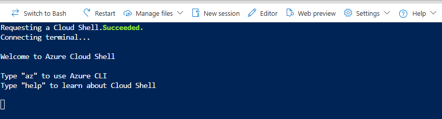
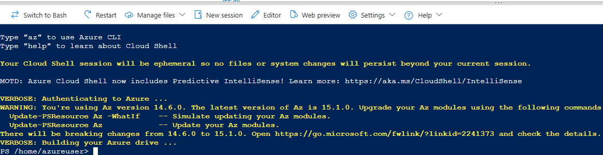
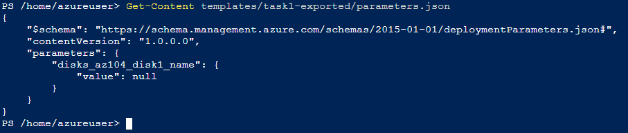
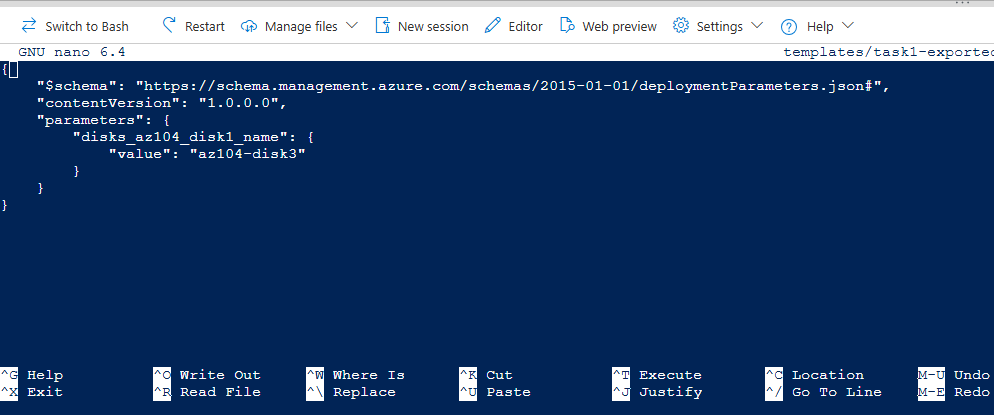
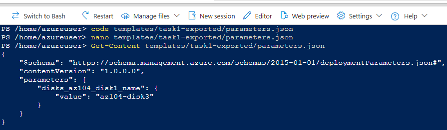

# Task 3 — Deploy ARM Template using Azure PowerShell (Cloud Shell)

This task documents how to deploy an ARM template using **Azure PowerShell** in **Azure Cloud Shell**.  
The goal is to reuse the exported ARM template from Task 1 and deploy a third managed disk (`az104-disk3`).

---

## Prerequisites

- Resource Group: **`az104-rg3`**
- ARM template files (from Task 1):
  - `templates/task1-exported/template.json`
  - `templates/task1-exported/parameters.json`
- Azure Portal access and permission to deploy resources
- Cloud Shell available in the Azure Portal

---

## Step 1 — Open Azure Cloud Shell (PowerShell)

1. In the Azure Portal, open **Cloud Shell**
2. Select **PowerShell** (not Bash)
3. When prompted, select **No storage account required**


> Note: Azure Cloud Shell can optionally use a storage account and file share to persist files between sessions.
>
> For this lab, **No storage account required** was selected because:
>
> - the environment is short-lived
> - templates are versioned in GitHub
> - persistence between sessions is not required

After selecting PowerShell and applying the configuration, Azure Cloud Shell initializes
a PowerShell session authenticated against the selected subscription.

This environment is now ready to execute Azure PowerShell cmdlets for ARM deployments.

---

## Step 2 — Upload the ARM template files

To reuse the ARM template exported in **Task 1**, the template files must be made
available inside **Azure Cloud Shell**.

This step ensures that the same template can be deployed using Azure PowerShell,
without copying or modifying its contents.



### Upload the template files

1. In Cloud Shell, click **Upload/Download files** → **Upload**
2. Upload the following files from your repository:

   - `template.json`
   - `parameters.json`

   Recommended source folder:

   - `templates/task1-exported/`


### Verify file presence in Cloud Shell

After the upload completes, confirm that the files are available in the current
Cloud Shell session:

```powershell
ls
```


This validation step ensures that the deployment will reuse the original ARM
template without modification, aligning with idempotent deployment principles.

## Step 3 — Review and adjust parameters (Cloud Shell / PowerShell)

Before deploying the ARM template using Azure PowerShell, review and adjust the **parameters** that control the deployment.

The ARM template used in this task is **the same template exported in Task 1**.

- ✅ The `template.json` file is **not modified**
- ✅ Only a **parameter value** is updated in `parameters.json`

---

### Goal of this step

Deploy a **new managed disk** using the same ARM template by changing only the disk name:

- **Previous deployment (Task 1):** `az104-disk1`
- **This deployment (Task 3):** `az104-disk3`

> ⚠️ The parameter name (for example, `disks_az104_disk1_name`) is generated automatically by the Azure Portal export.  
> What matters is the **parameter value**, which defines the resource name.

---

## Step-by-step procedure

### Step 3.1 — Open Azure Cloud Shell (PowerShell)

1. In the Azure Portal, open **Cloud Shell**
2. Select **PowerShell**



_Azure Cloud Shell initialized in PowerShell and ready to manage ARM templates._

---

### Step 3.2 — Create the folder structure in Cloud Shell

Cloud Shell does not automatically contain local project files.  
Create the same folder structure used in the repository:

```powershell
mkdir templates
mkdir templates/task1-exported
```

Confirm the folder was created:

```powershell
ls templates
```

### Step 3.3 — Upload the exported ARM files to Cloud Shell

Now upload the exported files from your local machine into Cloud Shell.

1. In Cloud Shell, click **Manage files**
2. Select **Upload**
3. Upload the following files:
   - `template.json`
   - `parameters.json`
4. Ensure they are uploaded into:
   - `/home/azureuser/templates/task1-exported`

### Step 3.4 — Organize the uploaded files

After the upload, confirm the files are in the home directory:

```powershell
ls
```

Move the files to the correct project folder:

```powershell
mv template.json templates/task1-exported/
mv parameters.json templates/task1-exported/
```

Verify that the files are now correctly placed:

```powershell
ls templates/task1-exported
```

Expected output:

```powershell
template.json
parameters.json
```

_ARM template and parameters files organized in the correct Cloud Shell directory._

### Step 3.5 — Review and update the parameters file

Review the current contents of the parameters file:

```powershell
Get-Content templates/task1-exported/parameters.json
```



_Viewing the contents of `parameters.json` before updating the disk name parameter (value is `null`)._

At this stage, the disk name parameter has no value assigned (`null`), so it must be updated before deployment.

Locate the disk name parameter value and confirm it is set to:

```powershell
"value": "az104-disk3"
```

If necessary, edit the file using:

```powershell
code templates/task1-exported/parameters.json
```

```powershell
nano templates/task1-exported/parameters.json
```



_Editing the `parameters.json` file in Azure Cloud Shell using `nano` to update the disk name parameter._

### Step 3.6 — Confirm updated parameter value



_Confirming that the disk name parameter was successfully updated to `az104-disk3` in `parameters.json`._

## Step 4 - Deploy the template using Azure PowerShell

## Step 5 - Validate the deployment

```

```
