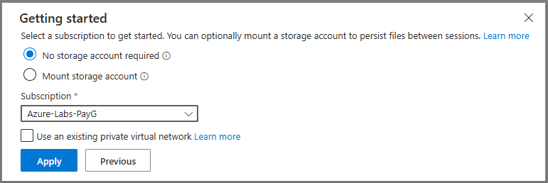
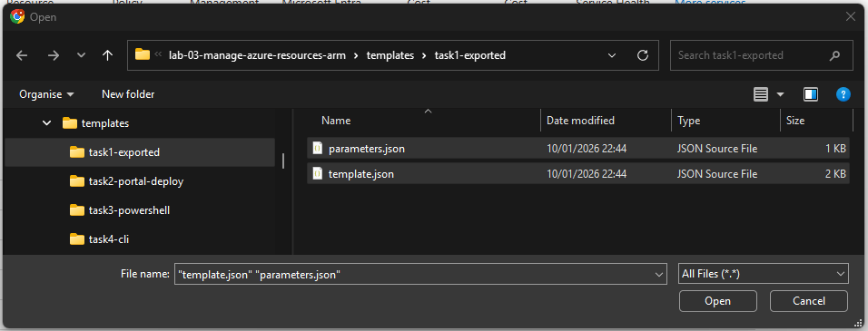
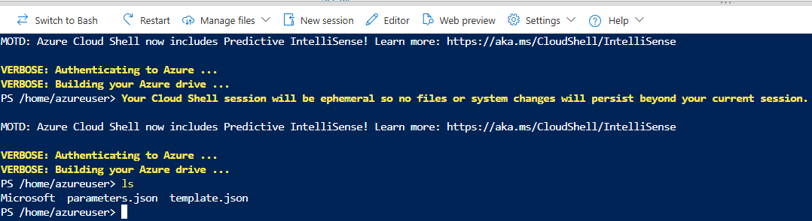

# Task 3 — Deploy ARM Template using Azure PowerShell (Cloud Shell)

This task documents how to deploy an ARM template using **Azure PowerShell** in **Azure Cloud Shell**.  
The goal is to reuse the exported ARM template from Task 1 and deploy a third managed disk (`az104-disk3`).

---

## Prerequisites

- Resource Group: **`az104-rg3`**
- ARM template files (from Task 1):
  - `templates/task1-exported/template.json`
  - `templates/task1-exported/parameters.json`
- Azure Portal access and permission to deploy resources
- Cloud Shell available in the Azure Portal

---

## Step 1 — Open Azure Cloud Shell (PowerShell)

1. In the Azure Portal, open **Cloud Shell**
2. Select **PowerShell** (not Bash)
3. When prompted, select **No storage account required**



> Note: Azure Cloud Shell can optionally use a storage account and file share to persist files between sessions.
>
> For this lab, **No storage account required** was selected because:
>
> - the environment is short-lived
> - templates are versioned in GitHub
> - persistence between sessions is not required

After selecting PowerShell and applying the configuration, Azure Cloud Shell initializes
a PowerShell session authenticated against the selected subscription.

This environment is now ready to execute Azure PowerShell cmdlets for ARM deployments.

---

## Step 2 — Upload the ARM template files

To reuse the ARM template exported in **Task 1**, the template files must be made
available inside **Azure Cloud Shell**.

This step ensures that the same template can be deployed using Azure PowerShell,
without copying or modifying its contents.

### Upload the template files

1. In Cloud Shell, click **Upload/Download files** → **Upload**
2. Upload the following files from your repository:

   - `template.json`
   - `parameters.json`

   Recommended source folder:

   - `templates/task1-exported/`



### Verify file presence in Cloud Shell

After the upload completes, confirm that the files are available in the current
Cloud Shell session:

```powershell
ls
```



This validation step ensures that the deployment will reuse the original ARM
template without modification, aligning with idempotent deployment principles.
