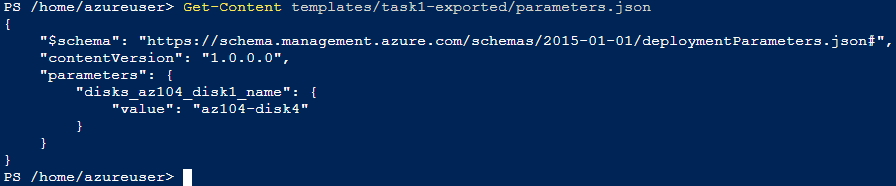
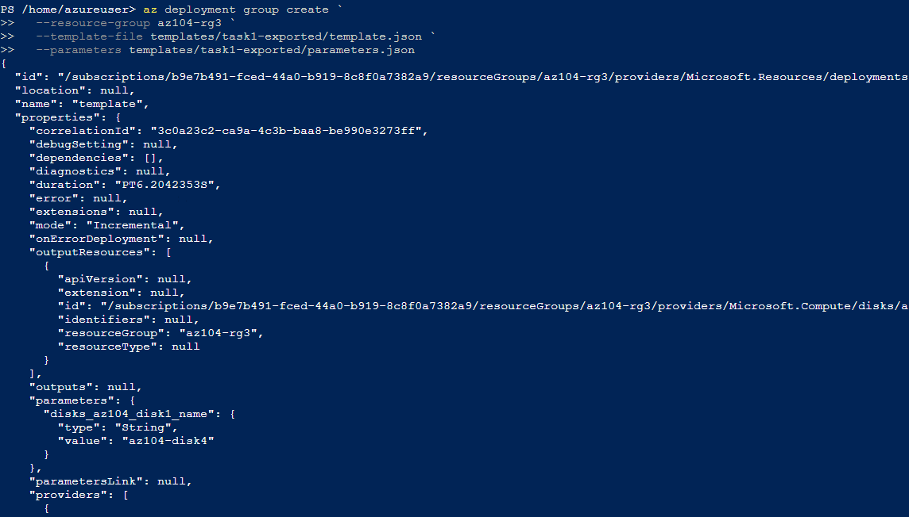
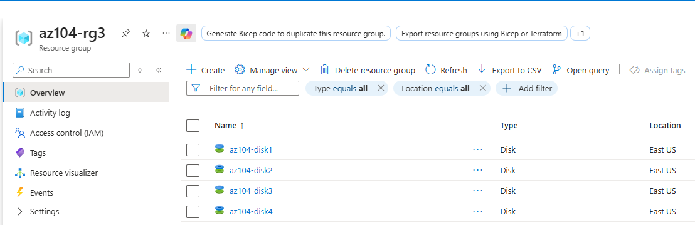

## Task 4 — Azure CLI Deployment (Cloud Shell)

### Step 1 — Prepare Cloud Shell and verify template files

In this task, the ARM template exported in **Task 1** is reused to deploy another managed disk using **Azure CLI** in **Azure Cloud Shell**.

1. Open **Azure Cloud Shell**
2. Use the existing session or start a new one
3. Ensure the template files from Task 1 are available

Verify that the ARM template and parameters files exist in the expected directory:

```powershell
ls templates/task1-exported
```

### Step 2 — Update the parameters file (disk name)

To deploy a new managed disk using the same ARM template, update **only** the disk name value in `parameters.json`.

> ✅ The `template.json` file remains unchanged.  
> ✅ Only the parameter value is modified.

---

#### Step 2.1 — Review the current parameters file

Display the current contents of the parameters file:

```powershell
Get-Content templates/task1-exported/parameters.json
```


_Reviewing the `parameters.json` file before updating the disk name parameter. The value is currently set to `null`._

### Step 2.2 — Edit the parameters file using nano

Open the file for editing:

```
nano templates/task1-exported/parameters.json
```

Update only the value to the new disk name:

```powershell
"value": "az104-disk4"
```


_Editing the `parameters.json` file in Azure Cloud Shell using `nano` to update the disk name to `az104-disk4`._

### Step 2.3 — Save and exit nano

Save the file and exit the editor:

1. Press Ctrl + O (Write Out)

2. Press Enter to confirm the file name

3. Press Ctrl + X to exit

### Step 2.4 — Confirm the updated parameter value

Confirm the change was applied:

```powershell
Get-Content templates/task1-exported/parameters.json
```

Expected output (example):

```powershell
"value": "az104-disk4"
```



_Confirming that the disk name parameter was successfully updated to `az104-disk4` in `parameters.json`._

### Step 3 — Deploy the ARM template using Azure CLI

With the parameters file updated, deploy the ARM template using **Azure CLI** from **Azure Cloud Shell**.

This deployment will create a **new managed disk** using the same template, controlled only by parameter values.

---

#### Step 3.1 — Run the deployment command

Execute the following command in Cloud Shell:

```bash
az deployment group create `
  --resource-group az104-rg3 `
  --template-file templates/task1-exported/template.json `
  --parameters templates/task1-exported/parameters.json

```

### Step 3.2 — Review the deployment output

If the deployment is successful, the output will include:

- `"provisioningState": "Succeeded"`

- The parameter value used for the deployment:

  - az104-disk4

Example indicators in the output:

```powershell
ProvisioningState : Succeeded
```



_Successful ARM template deployment using Azure CLI. The output confirms an incremental deployment and the creation of the managed disk `az104-disk4`._

### Step 4 — Verify the deployed resource in Azure Portal

After the successful deployment using Azure CLI, verify that the new managed disk was created in the Azure Portal.

1. In the Azure Portal, navigate to **Resource groups**
2. Open the resource group **az104-rg3**
3. Review the list of resources

The newly deployed managed disk should be visible:

- **Disk name:** `az104-disk4`
- **Resource type:** Managed disk
- **Status:** Available / Unattached



_Verifying in the Azure Portal that the managed disk `az104-disk4` was successfully created as a result of the Azure CLI deployment._

---

**Result:**  
The ARM template was successfully deployed using **Azure CLI**, and the new managed disk (`az104-disk4`) is confirmed both via **CLI output** and **Azure Portal verification**.
