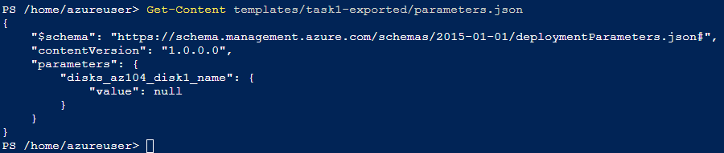
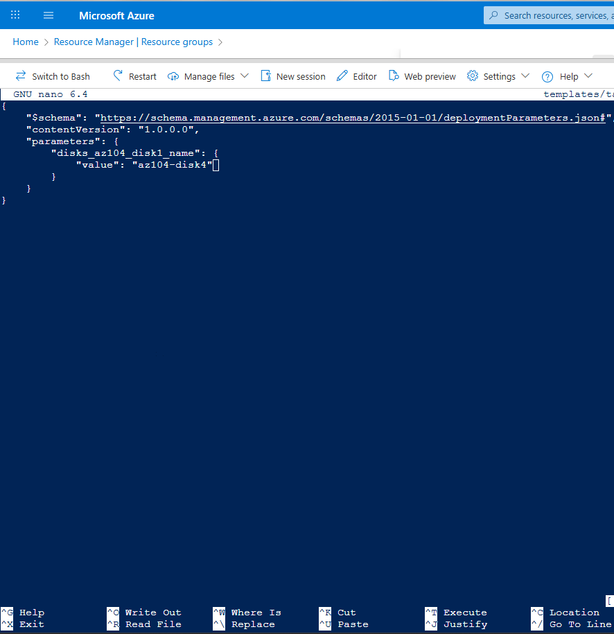

## Task 4 — Azure CLI Deployment (Cloud Shell)

### Step 1 — Prepare Cloud Shell and verify template files

In this task, the ARM template exported in **Task 1** is reused to deploy another managed disk using **Azure CLI** in **Azure Cloud Shell**.

1. Open **Azure Cloud Shell**
2. Use the existing session or start a new one
3. Ensure the template files from Task 1 are available

Verify that the ARM template and parameters files exist in the expected directory:

```powershell
ls templates/task1-exported
```

### Step 2 — Update the parameters file (disk name)

To deploy a new managed disk using the same ARM template, update **only** the disk name value in `parameters.json`.

> ✅ The `template.json` file remains unchanged.  
> ✅ Only the parameter value is modified.

---

#### Step 2.1 — Review the current parameters file

Display the current contents of the parameters file:

```powershell
Get-Content templates/task1-exported/parameters.json
```



_Reviewing the `parameters.json` file before updating the disk name parameter. The value is currently set to `null`._

### Step 2.2 — Edit the parameters file using nano

Open the file for editing:

```
nano templates/task1-exported/parameters.json
```

Update only the value to the new disk name:

```powershell
"value": "az104-disk4"
```



_Editing the `parameters.json` file in Azure Cloud Shell using `nano` to update the disk name to `az104-disk4`._

### Step 2.3 — Save and exit nano

Save the file and exit the editor:

1. Press Ctrl + O (Write Out)

2. Press Enter to confirm the file name

3. Press Ctrl + X to exit

### Step 2.4 — Confirm the updated parameter value

Confirm the change was applied:

```powershell
Get-Content templates/task1-exported/parameters.json
```

Expected output (example):
