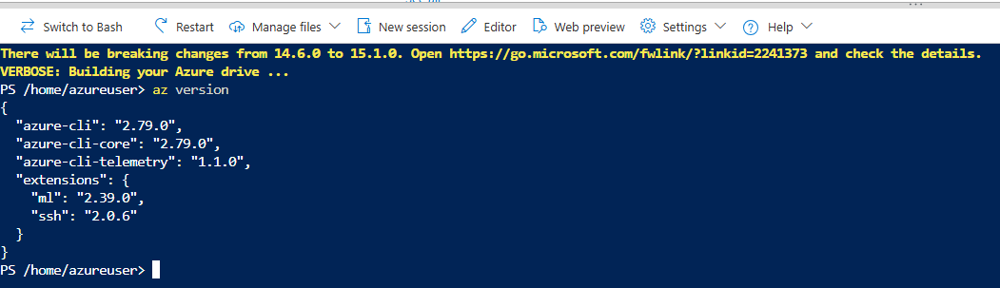
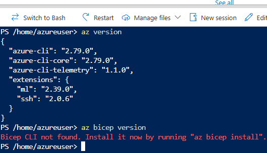
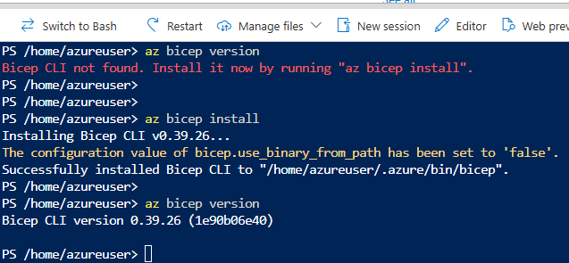
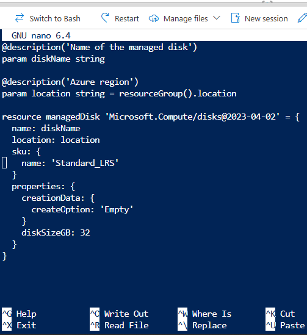
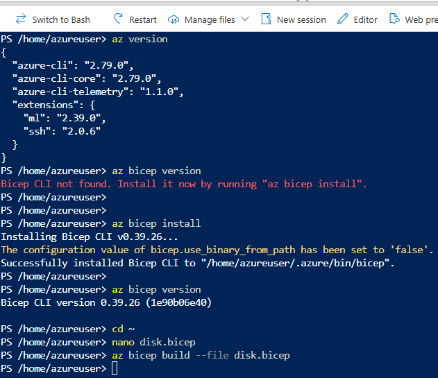
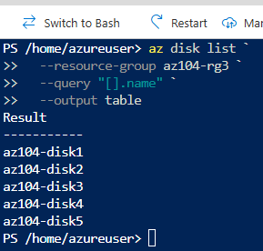

## Task 5 — Bicep Deployment

In this task, the Azure Managed Disk is deployed using **Azure Bicep**, the recommended
abstraction language for Azure Resource Manager (ARM).

The deployment creates a fifth managed disk (`az104-disk5`) in the existing
Resource Group (`az104-rg3`).

---

## Objective

- Deploy an Azure resource using **Bicep**
- Understand Bicep as a higher-level abstraction over ARM JSON
- Reuse the same deployment logic in a cleaner, more readable format
- Demonstrate declarative and idempotent deployments

---

## Step 1 — Prepare Azure Cloud Shell (Bash)

1. Open **Azure Cloud Shell**
2. Switch to **Bash**
3. Confirm that Azure CLI is available:

```bash
az version
```



_Verifying that Azure CLI is installed and available in Azure Cloud Shell before proceeding with the Bicep deployment._

> Azure Cloud Shell provides a preconfigured Azure CLI environment, eliminating local setup requirements.

Ensure that Bicep is installed:

```powershell
az bicep version
```



_The Azure CLI is available, but the Bicep CLI is not yet installed. Azure Cloud Shell prompts to install Bicep using the built-in command._

> Azure Bicep is not installed by default in all Cloud Shell sessions.
> The Bicep CLI must be installed before deploying resources using Bicep templates.

### Step 2 — Install and verify Bicep CLI

Azure Bicep is required to deploy resources using Bicep templates.
Since the Bicep CLI was not available by default, it must be installed in Azure Cloud Shell.

#### Step 2.1 — Install Bicep CLI

Install the Bicep CLI using Azure CLI:

```powershell
az bicep install
```

#### Step 2.2 — Verify Bicep installation

After installation, verify that Bicep is available:

```powershell
az bicep version
```



_The Bicep CLI was successfully installed and verified. The command output confirms that Bicep is available and ready to be used for deployments._

## Step 3 — Create the Bicep template

In this step, the ARM template used in previous tasks is translated into a Bicep template.
The goal is to deploy a **new managed disk** `(az104-disk5)` using Bicep syntax.

> ⚠️ This step focuses on `authoring the Bicep file`, not deploying it yet.

#### Step 3.1 — Create the Bicep file

From Azure Cloud Shell, navigate to a working directory (for example, your home folder):

```powershell
cd ~
```

Create a new Bicep file:

```powershell
nano disk.bicep
```

#### Step 3.2 — Define parameters and resource in Bicep

Add the following content to the disk.bicep file:

```powershell
@description('Name of the managed disk')
param diskName string

@description('Azure region')
param location string = resourceGroup().location

resource managedDisk 'Microsoft.Compute/disks@2023-04-02' = {
  name: diskName
  location: location
  sku: {
    name: 'Standard_LRS'
  }
  properties: {
    creationData: {
      createOption: 'Empty'
    }
    diskSizeGB: 32
  }
}

```



_Editing the Bicep template in Azure Cloud Shell using **nano**, defining parameters and the managed disk resource._

✅ Technical content confirmation (important)

The file is 100% correct:

✔️ `diskName` parameter  
✔️ `location` inherited from the resource group  
✔️ `Standard_LRS` SKU  
✔️ `createOption: 'Empty'`  
✔️ `diskSizeGB: 32`

This Bicep file defines:

- A **parameterized disk name**

- Automatic reuse of the **resource group location**

- A **Standard_LRS** managed disk with **32 GB**

#### Step 3.3 — Save and exit the editor

Save the file and exit nano:

1. Press **Ctrl** + **O** to write the file

2. Press **Enter** to confirm

3. Press **Ctrl** + **X** to exit

#### Step 3.4 — Validate the Bicep file syntax

Before deploying, validate that the Bicep file is syntactically correct:

```powershell
az bicep build --file disk.bicep
```

If the command completes without errors, the Bicep template is valid.



_Verifying the Azure CLI version, installing the Bicep CLI, creating the Bicep template, and compiling it using `az bicep build` in Azure Cloud Shell._

#### What this image proves (important for AZ-104)

✔️ Functional Azure CLI `(az version)`

✔️ Bicep **was not installed** (realistic scenario)

✔️ Manual installation of Bicep `(az bicep install)`

✔️ Version verification `(az bicep version)`

✔️ Creation of the `disk.bicep` file

✔️ Compilation to ARM JSON `(az bicep build)`

### Step 4 — Deploy the Bicep template using Azure CLI

With the Bicep template created and successfully compiled, the next step is to deploy it to the target Resource Group using **Azure CLI**.

This deployment creates a new managed disk using **Bicep**, which is transpiled and processed by **Azure Resource Manager (ARM)**.

> ✅ No existing resources are modified  
> ✅ A new managed disk is deployed declaratively  
> ✅ Deployment is executed at **Resource Group scope**

---

#### Step 4.1 — Review the Bicep template parameters

The Bicep template defines the following parameters:

- `diskName` — name of the managed disk
- `location` — Azure region (defaults to the resource group location)

Example (from `disk.bicep`):

```bicep
param diskName string
param location string = resourceGroup().location
```

These parameters will be supplied at deployment time.

#### Step 4.2 — Run the Bicep deployment command

Deploy the Bicep template to the existing Resource Group:

```powershell
az deployment group create `
  --resource-group az104-rg3 `
  --template-file disk.bicep `
  --parameters diskName=az104-disk5
```

Explanation of the command:

- `az deployment group create`  
  → Creates a deployment at Resource Group scope

- `--resource-group az104-rg3`  
  → Targets the existing lab Resource Group

- `--template-file disk.bicep`  
  → Uses the Bicep template (automatically transpiled to ARM)

- `--parameters diskName=az104-disk5`  
  → Supplies the disk name parameter for this deployment

#### Step 4.3 — Review the deployment output

If the deployment is successful, the output will show:

- `"provisioningState": "Succeeded"`

- Deployment mode: `Incremental`

- The parameter value used:

  - `diskName = az104-disk5`

Example indicator:

```powershell
ProvisioningState : Succeeded
```


_Successful deployment of a managed disk using Azure Bicep.  
The output confirms an **incremental ARM deployment** with the parameter `diskName` set to `az104-disk5`, resulting in the creation of a new managed disk._

This confirms that the managed disk az104-disk5 was successfully deployed using Bicep.

#### Step 4.4 — Verify the resource in the Resource Group

Confirm that the new disk exists in the Resource Group:

```powershell
az disk list `
  --resource-group az104-rg3 `
  --query "[].name" `
  --output table
```

Expected result includes:

```powershell
az104-disk1
az104-disk2
az104-disk3
az104-disk4
az104-disk5
```

#### Step 4.5 — Verify deployment history in the Azure Portal (optional)

In the Azure Portal:

1. Navigate to **Resource Groups**

2. Open **az104-rg3**

3. Select **Deployments**

The Bicep deployment appears as a standard ARM deployment entry, confirming that:

- Bicep deployments are tracked by ARM

- Deployment history is unified across Portal, PowerShell, CLI, and Bicep

### Step 5 — Verify the deployed disk (Azure CLI)

After the Bicep deployment completes successfully, verify that the new managed disk was created in the target Resource Group.

Run the following command:

```bash
az disk list `
  --resource-group az104-rg3 `
  --query "[].name" `
  --output table
```


