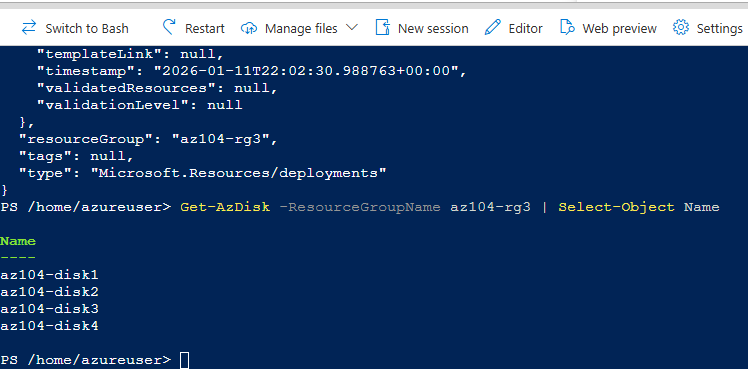
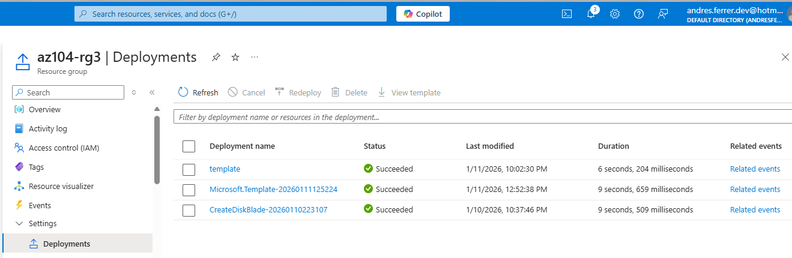

## Task 5 — Validate idempotency and deployment history

This task validates two key ARM concepts:

- **Idempotency:** re-running the same deployment should not create duplicate resources
- **Deployment history:** Azure keeps a record of deployments at the resource group scope

The goal is to re-run the deployment (using the same template + same parameters) and confirm that no additional managed disks are created.

---

### Prerequisites

- Resource Group: `az104-rg3`
- ARM template files available in Cloud Shell:
  - `templates/task1-exported/template.json`
  - `templates/task1-exported/parameters.json`
- The parameters file already contains:
  - `az104-disk4`

---

### Step 1 — Confirm the current disk list (baseline)

Before re-running the deployment, capture the current state of disks in the resource group:

```powershell
Get-AzDisk -ResourceGroupName az104-rg3 | Select-Object Name
```



_Verifying that re-running the deployment did not create additional managed disks. The disk list remains unchanged, confirming idempotent behavior._

### Step 4 — Review deployment history in Azure Portal

Azure keeps a record of every deployment executed at the resource group scope.  
In this step, verify that the re-run deployment is registered without creating duplicate resources.

---

#### Step 4.1 — Open deployment history

1. In the **Azure Portal**, navigate to:
   - **Resource groups**
2. Open the resource group:
   - `az104-rg3`
3. In the left-hand menu, select:
   - **Deployments**

This view lists all deployments executed against the resource group.

---

#### Step 4.2 — Review deployment entries

In the **Deployments** list, verify the following:

- Multiple deployment entries are visible
- The most recent deployment corresponds to the re-run executed in this task
- The **Provisioning state** is **Succeeded**
- Deployment timestamps reflect multiple executions

This confirms that Azure tracks each deployment execution independently, even when no changes are applied.

---

#### Step 4.3 — Capture deployment history evidence

Take a screenshot showing:

- The **Deployments** list for resource group `az104-rg3`
- At least two successful deployments
- The most recent deployment timestamp



_Reviewing the deployment history for resource group `az104-rg3`. Multiple successful deployments are recorded, confirming that re-running the same deployment is tracked without creating duplicate resources._

---

### Result

- The deployment was re-run using the same ARM template and parameters.
- Azure recorded the deployment execution in the resource group history.
- No additional managed disks were created.

This confirms both **deployment history tracking** and **idempotent behavior** of ARM deployments.
