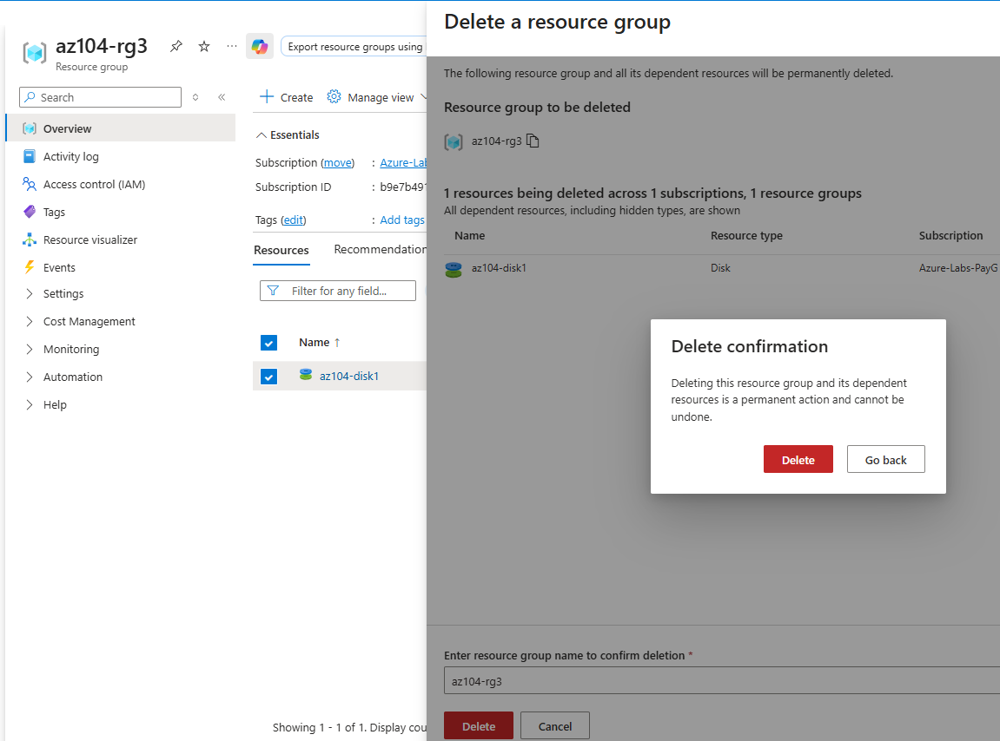
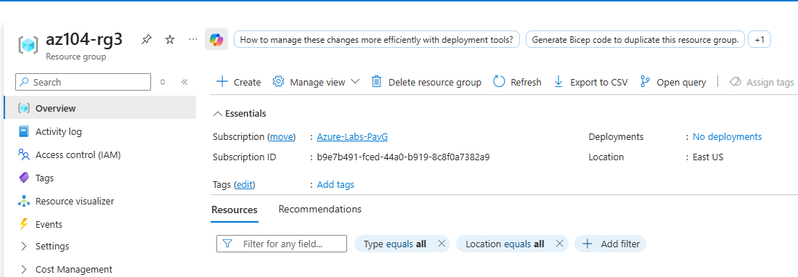

# Troubleshooting and Cleanup

## Disk recreated for documentation accuracy

**Issue**  
Screenshots were not captured in the correct order during the initial execution of Task 1.

**Action taken**  
The managed disk `az104-disk1` and its Resource Group were deleted and recreated to ensure a clean and well-documented execution.

**Evidence**

- Resource group deletion confirmation  
  

- Resource group after cleanup  
  

**Reasoning**

- Ensures accurate step-by-step documentation
- Avoids confusion between deployment, resource, and export stages
- Reflects real-world cleanup and lifecycle management practices

**Lesson learned**
Always capture screenshots immediately after each major step when documenting infrastructure deployments.
